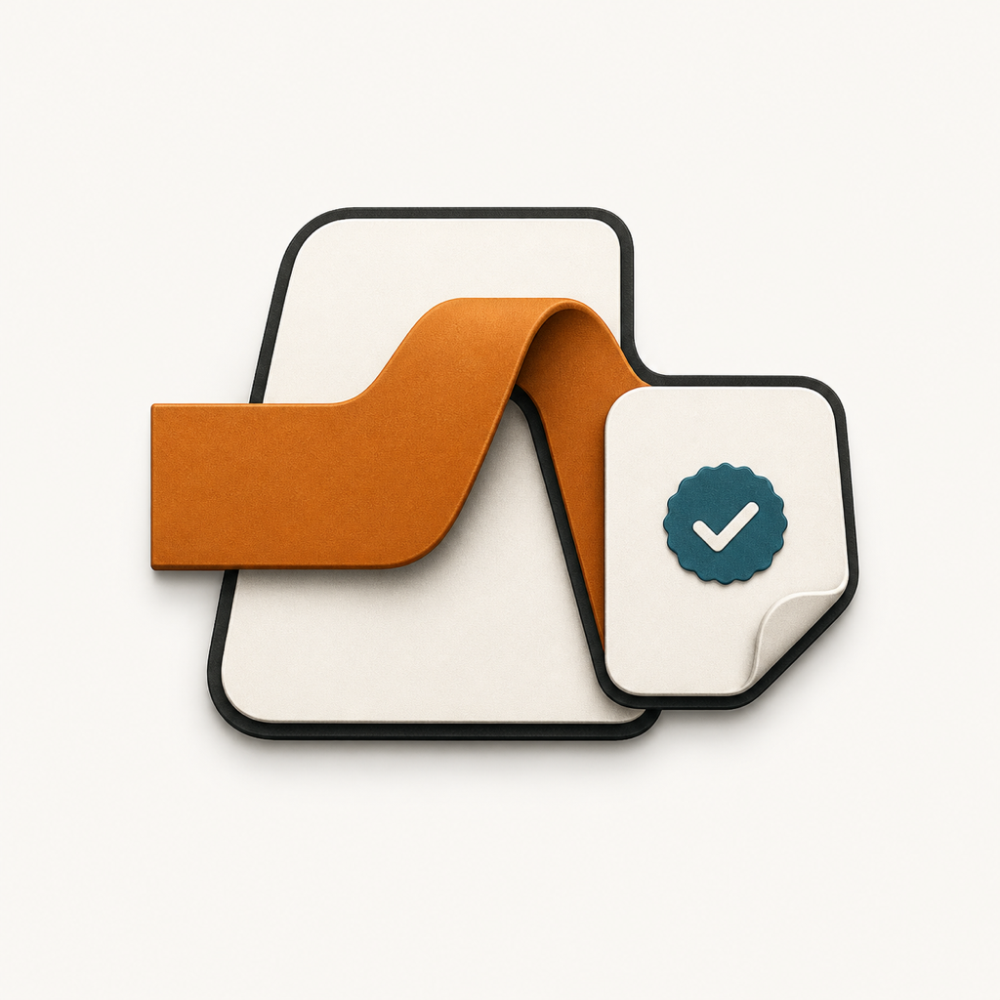

<p align="center">
  
</p>

<h1 align="center">AI Employee OS</h1>

<p align="center">
  A local-first macOS runtime for AI employees that can converse, execute governed work, and deliver auditable artifacts.
</p>

<p align="center">
  <a href="README.md">English</a> | <a href="README.zh-CN.md">简体中文</a>
</p>

<p align="center">
  <a href="https://github.com/kakarrot-dev/AI-Employee-OS/actions/workflows/ci.yml"></a>
  
  
  
</p>

> [!IMPORTANT]
> AI Employee OS is under active development. The current repository provides a runnable local MVP for development and evaluation, not a notarized end-user release.

## What it does

AI Employee OS turns an AI assistant into a governed local worker. The macOS client handles interaction and Keychain access, the Rust runtime owns state and permissions, and the Python worker handles intent, context, planning, and model calls.

Fresh installs seed Alex (`ai-product-manager`) plus two least-privilege specialists: a data researcher (`data-researcher`) bound only to `web-search`, and a document writer (`document-writer`) bound only to `local-file-operations`. Users can permanently delete any built-in employee so bootstrap will not restore it. Multiple employee profiles can also be created and edited. Work execution requires a bound Skill with Manifest `schema_version: 2.0.0` and readiness `ready`. Legacy Manifest 1.0 skills such as `prd-generation` are `incompatible` with the Generic Run Kernel if still present.

## Current capabilities

- Native SwiftUI workspace with Office, Contacts, Work, Archive, Knowledge, Skills, Tools, and Settings.
- Persistent multi-turn conversations backed by SQLite.
- A single Office task composer that produces a validated single- or multi-employee proposal before execution.
- Persistent Task Threads rendered as task collaboration rooms with employee replies, approvals, handoffs, progress, and deliverables.
- A unified Archive for private conversations and Task Threads, while preserving their distinct Runtime deletion semantics.
- Employee Identity, Soul, and Persona editing, with the effective prompt compiled by the Rust runtime.
- Intent routing between conversation and governed task execution via Resolver and the Generic Run Kernel (Golden Path removed).
- Repository-installed Agent, Skill, and Tool packages. Built-in tools on mainline: `file-tool` (read / create / edit) and `agent-reach-tool` (`search_web`).
- Executable skills on mainline: `local-file-operations` and `web-search`.
- A serial multi-employee mainline for public-web research, verified handoff, and an approved Markdown file artifact.
- Task and Action state machines with approval, cancellation, audit, events, and recovery.
- Tool execution through the Rust `ToolExecutor`, including idempotency and result verification.
- Real-network `web-search` requires local `mcporter` + Exa and is therefore not a dependency-free CI gate.
- Local packaging of the Swift client, Rust runtime, Python worker, and built-in packages into a macOS app bundle.
- Claude Cream design tokens with light and dark appearances.

## Architecture

```text
Swift macOS Client
  UI, local stores, Keychain
        |
        v
Thin Rust Runtime
  Task, Action, Permission, Approval, Tool Gateway, SQLite, Events
        |
        v
Python Agent Worker
  Intent, Chat, Context, Planning, LLM Provider
```

The trust boundary is deliberate:

- Swift does not reason or execute tools.
- Python does not receive direct system permissions.
- Every tool call passes through the Rust `ToolExecutor`.
- Secrets remain in macOS Keychain and controlled process environments. They must not enter SQLite, logs, traces, memory, or agent context.

See the [Unified Data Model](docs/AI%20Employee%20OS%20Unified%20Data%20Model%20v1.0.md) and [MVP API & Interface Specification](docs/AI%20Employee%20OS%20MVP%20API%20&%20Interface%20Specification%20v1.0.md) for the canonical contracts.

## Requirements

- macOS 14 or later
- Swift 5.10 toolchain
- Stable Rust toolchain with `rustfmt`
- Python 3.13
- A DeepSeek API key for real model conversations
- A local code-signing identity for building the app bundle

## Quick start

Clone the repository:

```bash
git clone https://github.com/kakarrot-dev/AI-Employee-OS.git
cd AI-Employee-OS
```

Create the local development signing identity once:

```bash
./scripts/setup_local_signing_identity.sh
```

Run the complete verification gate:

```bash
./scripts/check.sh
```

Build and launch the macOS app:

```bash
./script/build_and_run.sh
```

The packaged application is written to `dist/AIEmployee.app`. Runtime data is stored under `~/Library/Application Support/AIEmployee/` and is never written into the read-only app bundle.

## Configure the model

1. Open Settings in the app.
2. Save the DeepSeek API key to macOS Keychain.
3. Open Work and select an active employee (fresh installs include Alex and the two specialists; create one in Contacts if you deleted them).
4. Start a conversation or submit a work request.

DeepSeek Chat Completions are stateless. The runtime reconstructs the ordered conversation from SQLite for every model request.

## Development commands

```bash
# Full Rust, Python, contract, runtime, and Swift model checks
./scripts/check.sh

# Rust runtime tests
cargo test --manifest-path runtime/rust-core/Cargo.toml

# Build the Swift client
swift build --package-path apps/macos/AIEmployee

# Build, launch, and verify the signed app bundle
./script/build_and_run.sh --verify

# Launch deterministic UI demo data
./script/build_and_run.sh --ui-demo office
```

CI runs `./scripts/check.sh` on `macos-latest` for every pull request and every push to `main`.

## Repository layout

```text
apps/macos/AIEmployee/     SwiftUI macOS client
runtime/rust-core/         Rust runtime and security boundary
runtime/python-agent/      Python agent worker
contracts/                 Machine-readable JSON Schema contracts
packages/                  Built-in Agent, Skill, and Tool packages
storage/migrations/        Append-only SQLite migrations
docs/                      Product, architecture, security, and UI documents
scripts/                   Verification and local setup
script/                    App packaging and distribution checks
```

## MVP boundaries

The current MVP includes real conversations, employee profile editing, repository package installation, a unified natural-language task entry, validated single- or multi-employee proposals, governed Task Thread execution, task inspection, and unified archive navigation.

The following capabilities are intentionally out of scope for the current MVP:

- Computer Use and arbitrary website scraping
- Parallel Multi-Agent scheduling and free-form employee group chat outside Task Threads
- Cloud Sync
- Marketplace distribution
- Enterprise RBAC
- Notarized distribution, automatic updates, and DMG packaging

Governed web search through `agent-reach-tool` / `web-search` is packaged and bound, but real-network end-to-end validation still depends on local `mcporter` + Exa and is not the default CI gate.

Runtime infrastructure for Memory, Knowledge, Evaluation, permissions, approval, and tracing exists, but not every capability is fully exposed in the product interface.

## Documentation

- [Architecture overview](docs/架构总览.md)
- [Unified Data Model](docs/AI%20Employee%20OS%20Unified%20Data%20Model%20v1.0.md)
- [MVP API & Interface Specification](docs/AI%20Employee%20OS%20MVP%20API%20&%20Interface%20Specification%20v1.0.md)
- [Security & Permission Architecture](docs/AI%20Employee%20OS%20Security%20&%20Permission%20Architecture%20v1.0.md)
- [Architecture Decision Records](docs/AI%20Employee%20OS%20技术决策记录%20ADR（Architecture%20Decision%20Records）v1.0.md)
- [macOS Main Interface Spec v2.0](docs/design-system/AI%20Employee%20macOS%20Main%20Interface%20Spec%20v2.0.md)
- [Claude Cream macOS UI](docs/design-system/Claude%20Cream%20macOS%20UI.md)
- Historical: [Release 1](docs/releases/Release%201%20Decision%20Substrate.md) · [Release 2](docs/releases/Release%202%20Execution%20and%20Evidence.md) · [Release 3](docs/releases/Release%203%20Agent%20Experience%20and%20Production.md)

## Contributing

Issues and pull requests are welcome. Before opening a pull request:

1. Keep changes within the current MVP and canonical contracts.
2. Add or update tests for deterministic behavior.
3. Run `./scripts/check.sh`.
4. Do not commit secrets, runtime databases, build products, or local configuration.

Read [AGENTS.md](AGENTS.md) for architecture boundaries, source-of-truth order, state invariants, and verification requirements.

## Security

Do not report credentials or private data in a public issue. Never commit API keys, tokens, cookies, private keys, real user data, or runtime databases. All tool side effects must pass through the Rust runtime's permission, approval, audit, and idempotency controls.

## License

No license has been selected yet. The source is publicly visible, but no permission is currently granted to use, modify, or redistribute it. Add an explicit open-source license before treating the project as licensed open-source software.
