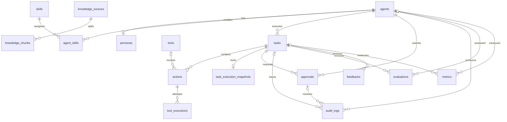

# AI Employee OS Unified Data Model v1.0

> [!warning] 单一事实源
> 本文档是 AI Employee OS MVP 持久化模型的 canonical schema。LLD、各 Engineering Guide 和 Code Skeleton 只描述领域语义或 migration 组织方式，不再维护独立建表定义。

## 1. 模型边界

MVP 数据模型包含 19 张表：

- Identity：`subjects`
- Agent：`agents`、`personas`
- Capability：`skills`、`agent_skills`、`tools`
- Execution：`tasks`、`actions`、`tool_executions`、`task_execution_snapshots`
- Context：`memories`、`knowledge_sources`、`knowledge_chunks`
- Security：`permissions`、`approvals`、`audit_logs`
- Evaluation：`evaluations`、`feedbacks`、`metrics`

Knowledge 表示外部事实和资料索引，Memory 表示运行中形成的偏好、经验、事实判断、决策与模式。两者保持分离。MVP 通过 Knowledge Tool 检索本地资料和 `knowledge/seed` 预置内容，不包含实时网页抓取。

## 2. 实体关系



`tasks ||--o{ approvals` 表示每条 Approval 必须属于一个 Task，而每个 Task 可以有零到多条 Approval，与 `approvals.task_id NOT NULL` 一致。

`memories.owner_id` 和 `permissions.subject_id` 是多态引用，无法由 SQLite 单一外键完整表达。MVP 不增加触发器模拟多态外键；应用层必须根据对应 type 字段验证目标是否存在，数据库层不保证这两处引用完整性。

## 3. 通用约定

- ID 使用应用层生成的字符串，数据库类型为 `TEXT`。
- 时间使用 ISO 8601 UTC 字符串，数据库类型为 `TEXT`，字段以 `_at` 结尾。
- JSON 使用 `TEXT` 存储，字段以 `_json` 结尾，并通过 SQLite JSON1 的 `json_valid()` 校验。
- 布尔值使用 `INTEGER`，只允许 `0` 或 `1`。
- 外键由 `PRAGMA foreign_keys = ON` 启用。
- 普通从属数据按关系使用 `CASCADE` 或 `RESTRICT`；审计记录通过 `SET NULL` 保留证据。
- `audit_logs` 是追加写记录。应用层不得更新或删除既有审计事件。

## 4. Canonical SQLite DDL

```sql
PRAGMA foreign_keys = ON;

CREATE TABLE agents (
  id TEXT PRIMARY KEY,
  name TEXT NOT NULL,
  role TEXT NOT NULL,
  package_path TEXT NOT NULL,
  status TEXT NOT NULL CHECK (status IN ('active', 'disabled')),
  created_at TEXT NOT NULL,
  updated_at TEXT NOT NULL
);

CREATE TABLE subjects (
  id TEXT NOT NULL,
  type TEXT NOT NULL CHECK (type IN ('user', 'company')),
  name TEXT NOT NULL,
  status TEXT NOT NULL CHECK (status IN ('active', 'disabled')),
  created_at TEXT NOT NULL,
  updated_at TEXT NOT NULL,
  PRIMARY KEY (type, id)
);

CREATE TABLE personas (
  agent_id TEXT PRIMARY KEY,
  communication_json TEXT NOT NULL CHECK (json_valid(communication_json)),
  thinking_json TEXT NOT NULL CHECK (json_valid(thinking_json)),
  decision_json TEXT NOT NULL CHECK (json_valid(decision_json)),
  habit_json TEXT NOT NULL CHECK (json_valid(habit_json)),
  created_at TEXT NOT NULL,
  updated_at TEXT NOT NULL,
  FOREIGN KEY (agent_id) REFERENCES agents(id) ON DELETE CASCADE
);

CREATE TABLE skills (
  id TEXT PRIMARY KEY,
  name TEXT NOT NULL,
  version TEXT NOT NULL,
  manifest_json TEXT NOT NULL CHECK (json_valid(manifest_json)),
  path TEXT NOT NULL,
  status TEXT NOT NULL CHECK (status IN ('active', 'disabled')),
  created_at TEXT NOT NULL,
  updated_at TEXT NOT NULL,
  UNIQUE (name, version)
);

CREATE TABLE agent_skills (
  agent_id TEXT NOT NULL,
  skill_id TEXT NOT NULL,
  enabled INTEGER NOT NULL DEFAULT 1 CHECK (enabled IN (0, 1)),
  created_at TEXT NOT NULL,
  PRIMARY KEY (agent_id, skill_id),
  FOREIGN KEY (agent_id) REFERENCES agents(id) ON DELETE CASCADE,
  FOREIGN KEY (skill_id) REFERENCES skills(id) ON DELETE RESTRICT
);

CREATE TABLE tools (
  id TEXT PRIMARY KEY,
  name TEXT NOT NULL,
  type TEXT NOT NULL,
  version TEXT NOT NULL,
  manifest_json TEXT NOT NULL CHECK (json_valid(manifest_json)),
  status TEXT NOT NULL CHECK (status IN ('active', 'disabled')),
  created_at TEXT NOT NULL,
  updated_at TEXT NOT NULL,
  UNIQUE (name, version)
);

CREATE TABLE tasks (
  id TEXT PRIMARY KEY,
  agent_id TEXT NOT NULL,
  input TEXT NOT NULL,
  status TEXT NOT NULL CHECK (
    status IN ('pending', 'running', 'succeeded', 'failed', 'cancelled')
  ),
  created_at TEXT NOT NULL,
  updated_at TEXT NOT NULL,
  FOREIGN KEY (agent_id) REFERENCES agents(id) ON DELETE RESTRICT
);

CREATE TABLE actions (
  id TEXT PRIMARY KEY,
  task_id TEXT NOT NULL,
  tool_id TEXT,
  input_json TEXT NOT NULL CHECK (json_valid(input_json)),
  output_json TEXT CHECK (output_json IS NULL OR json_valid(output_json)),
  status TEXT NOT NULL CHECK (
    status IN (
      'pending', 'running', 'succeeded', 'failed',
      'blocked', 'result_unknown', 'cancelled'
    )
  ),
  created_at TEXT NOT NULL,
  updated_at TEXT NOT NULL,
  FOREIGN KEY (task_id) REFERENCES tasks(id) ON DELETE CASCADE,
  FOREIGN KEY (tool_id) REFERENCES tools(id) ON DELETE RESTRICT
);

CREATE TABLE runtime_events (
  task_id TEXT NOT NULL,
  sequence INTEGER NOT NULL CHECK (sequence >= 1),
  event_id TEXT NOT NULL UNIQUE,
  event_type TEXT NOT NULL,
  payload_json TEXT NOT NULL CHECK (json_valid(payload_json)),
  occurred_at TEXT NOT NULL,
  PRIMARY KEY (task_id, sequence),
  FOREIGN KEY (task_id) REFERENCES tasks(id) ON DELETE CASCADE
);

CREATE TABLE task_cancellation_requests (
  task_id TEXT PRIMARY KEY,
  requested_at TEXT NOT NULL,
  acknowledged_at TEXT,
  FOREIGN KEY (task_id) REFERENCES tasks(id) ON DELETE CASCADE
);

CREATE TABLE tool_executions (
  call_id TEXT PRIMARY KEY,
  action_id TEXT NOT NULL,
  idempotency_key TEXT NOT NULL UNIQUE,
  attempt INTEGER NOT NULL CHECK (attempt >= 1),
  status TEXT NOT NULL CHECK (
    status IN ('running', 'succeeded', 'failed', 'blocked', 'result_unknown', 'cancelled')
  ),
  side_effect_state TEXT NOT NULL CHECK (
    side_effect_state IN ('none', 'not_started', 'confirmed', 'unknown')
  ),
  result_json TEXT CHECK (result_json IS NULL OR json_valid(result_json)),
  started_at TEXT NOT NULL,
  finished_at TEXT,
  trace_id TEXT NOT NULL,
  FOREIGN KEY (action_id) REFERENCES actions(id) ON DELETE CASCADE,
  UNIQUE (action_id, attempt)
);

CREATE TABLE task_execution_snapshots (
  task_id TEXT PRIMARY KEY,
  skill_snapshot_json TEXT NOT NULL CHECK (json_valid(skill_snapshot_json)),
  toolset_snapshot_json TEXT NOT NULL CHECK (json_valid(toolset_snapshot_json)),
  persona_snapshot_json TEXT NOT NULL CHECK (json_valid(persona_snapshot_json)),
  context_policy_snapshot_json TEXT NOT NULL CHECK (json_valid(context_policy_snapshot_json)),
  permission_snapshot_json TEXT NOT NULL CHECK (json_valid(permission_snapshot_json)),
  provider_config_snapshot_json TEXT NOT NULL CHECK (json_valid(provider_config_snapshot_json)),
  created_at TEXT NOT NULL,
  FOREIGN KEY (task_id) REFERENCES tasks(id) ON DELETE CASCADE
);

CREATE TABLE memories (
  id TEXT PRIMARY KEY,
  owner_type TEXT NOT NULL CHECK (owner_type IN ('user', 'agent', 'company')),
  owner_id TEXT NOT NULL,
  memory_type TEXT NOT NULL CHECK (
    memory_type IN ('preference', 'experience', 'fact', 'decision', 'pattern')
  ),
  content TEXT NOT NULL,
  importance REAL NOT NULL CHECK (importance BETWEEN 0.0 AND 1.0),
  confidence REAL NOT NULL CHECK (confidence BETWEEN 0.0 AND 1.0),
  created_at TEXT NOT NULL,
  updated_at TEXT NOT NULL
);

CREATE TABLE memory_provenance (
  memory_id TEXT PRIMARY KEY,
  task_id TEXT NOT NULL,
  trace_id TEXT NOT NULL,
  extractor_version TEXT NOT NULL,
  trust TEXT NOT NULL CHECK (trust IN ('untrusted_data')),
  created_at TEXT NOT NULL,
  FOREIGN KEY (memory_id) REFERENCES memories(id) ON DELETE CASCADE,
  FOREIGN KEY (task_id) REFERENCES tasks(id) ON DELETE RESTRICT
);

CREATE TABLE knowledge_sources (
  id TEXT PRIMARY KEY,
  uri TEXT NOT NULL UNIQUE,
  source_type TEXT NOT NULL CHECK (
    source_type IN ('local_file', 'seed_document')
  ),
  title TEXT NOT NULL,
  content_hash TEXT NOT NULL,
  index_status TEXT NOT NULL CHECK (
    index_status IN ('pending', 'indexed', 'failed', 'stale')
  ),
  created_at TEXT NOT NULL,
  updated_at TEXT NOT NULL
);

CREATE TABLE knowledge_chunks (
  id TEXT PRIMARY KEY,
  source_id TEXT NOT NULL,
  chunk_index INTEGER NOT NULL CHECK (chunk_index >= 0),
  content TEXT NOT NULL,
  content_hash TEXT NOT NULL,
  embedding_ref TEXT,
  created_at TEXT NOT NULL,
  UNIQUE (source_id, chunk_index),
  FOREIGN KEY (source_id) REFERENCES knowledge_sources(id) ON DELETE CASCADE
);

CREATE TABLE permissions (
  id TEXT PRIMARY KEY,
  subject_type TEXT NOT NULL CHECK (subject_type IN ('user', 'agent', 'company')),
  subject_id TEXT NOT NULL,
  resource TEXT NOT NULL,
  action TEXT NOT NULL,
  effect TEXT NOT NULL CHECK (effect IN ('allow', 'deny')),
  created_at TEXT NOT NULL,
  updated_at TEXT NOT NULL,
  UNIQUE (subject_type, subject_id, resource, action)
);

CREATE TABLE scoped_permission_grants (
  id TEXT PRIMARY KEY,
  task_id TEXT NOT NULL,
  action_id TEXT NOT NULL,
  subject_id TEXT NOT NULL,
  resource TEXT NOT NULL,
  action TEXT NOT NULL,
  expires_at TEXT NOT NULL,
  consumed_at TEXT,
  created_at TEXT NOT NULL,
  FOREIGN KEY (task_id) REFERENCES tasks(id) ON DELETE RESTRICT,
  FOREIGN KEY (action_id) REFERENCES actions(id) ON DELETE RESTRICT,
  FOREIGN KEY (subject_id) REFERENCES agents(id) ON DELETE RESTRICT,
  UNIQUE (task_id, action_id, action)
);

CREATE TABLE approvals (
  id TEXT PRIMARY KEY,
  task_id TEXT NOT NULL,
  agent_id TEXT NOT NULL,
  action TEXT NOT NULL,
  risk_level INTEGER NOT NULL CHECK (risk_level BETWEEN 0 AND 3),
  status TEXT NOT NULL CHECK (
    status IN ('pending', 'approved', 'rejected', 'expired')
  ),
  created_at TEXT NOT NULL,
  resolved_at TEXT,
  FOREIGN KEY (task_id) REFERENCES tasks(id) ON DELETE RESTRICT,
  FOREIGN KEY (agent_id) REFERENCES agents(id) ON DELETE RESTRICT
);

CREATE TABLE audit_logs (
  id TEXT PRIMARY KEY,
  agent_id TEXT,
  task_id TEXT,
  approval_id TEXT,
  action TEXT NOT NULL,
  resource TEXT NOT NULL,
  result TEXT NOT NULL,
  created_at TEXT NOT NULL,
  FOREIGN KEY (agent_id) REFERENCES agents(id) ON DELETE SET NULL,
  FOREIGN KEY (task_id) REFERENCES tasks(id) ON DELETE SET NULL,
  FOREIGN KEY (approval_id) REFERENCES approvals(id) ON DELETE SET NULL
);

CREATE TABLE evaluations (
  id TEXT PRIMARY KEY,
  task_id TEXT NOT NULL,
  agent_id TEXT NOT NULL,
  score REAL NOT NULL CHECK (score BETWEEN 0.0 AND 1.0),
  metrics_json TEXT NOT NULL CHECK (json_valid(metrics_json)),
  created_at TEXT NOT NULL,
  FOREIGN KEY (task_id) REFERENCES tasks(id) ON DELETE CASCADE,
  FOREIGN KEY (agent_id) REFERENCES agents(id) ON DELETE RESTRICT
);

CREATE TABLE feedbacks (
  id TEXT PRIMARY KEY,
  task_id TEXT NOT NULL,
  rating INTEGER NOT NULL CHECK (rating BETWEEN 1 AND 5),
  comment TEXT,
  created_at TEXT NOT NULL,
  FOREIGN KEY (task_id) REFERENCES tasks(id) ON DELETE CASCADE
);

CREATE TABLE metrics (
  id TEXT PRIMARY KEY,
  task_id TEXT,
  agent_id TEXT,
  name TEXT NOT NULL,
  value REAL NOT NULL,
  recorded_at TEXT NOT NULL,
  FOREIGN KEY (task_id) REFERENCES tasks(id) ON DELETE SET NULL,
  FOREIGN KEY (agent_id) REFERENCES agents(id) ON DELETE SET NULL
);

CREATE INDEX idx_tasks_agent_status ON tasks(agent_id, status);
CREATE INDEX idx_actions_task_created ON actions(task_id, created_at);
CREATE INDEX idx_runtime_events_task_sequence ON runtime_events(task_id, sequence);
CREATE INDEX idx_tool_executions_action_started ON tool_executions(action_id, started_at);
CREATE INDEX idx_tool_executions_trace ON tool_executions(trace_id);
CREATE INDEX idx_memories_owner_type ON memories(owner_type, owner_id, memory_type);
CREATE INDEX idx_knowledge_sources_status ON knowledge_sources(index_status);
CREATE INDEX idx_knowledge_chunks_source ON knowledge_chunks(source_id, chunk_index);
CREATE INDEX idx_approvals_task_status ON approvals(task_id, status);
CREATE INDEX idx_audit_logs_task_created ON audit_logs(task_id, created_at);
CREATE INDEX idx_evaluations_task_created ON evaluations(task_id, created_at);
CREATE INDEX idx_feedbacks_task_created ON feedbacks(task_id, created_at);
CREATE INDEX idx_metrics_name_recorded ON metrics(name, recorded_at);
```

## 5. 表职责与删除策略

| 表 | 职责 | 关键关系 | 删除策略 |
| --- | --- | --- | --- |
| `agents` | AI Employee 身份与包位置 | Persona、Skill、Task 的根实体 | 存在 Task、Approval 或 Evaluation 时限制删除 |
| `subjects` | User 与 Company 的最小引用主体 | Memory 与 Permission 的应用层引用目标 | 有引用时由应用层限制删除 |
| `personas` | Agent 的沟通、思考、决策和习惯配置 | 一对一关联 Agent | Agent 删除时级联删除 |
| `skills` | 可版本化 Skill 清单 | 与 Agent 多对多 | 已分配时限制删除 |
| `agent_skills` | Agent 的 Skill 启用状态 | 连接 Agent 与 Skill | Agent 删除时级联，Skill 删除时限制 |
| `tools` | 可调用 Tool 清单 | 被 Action 引用 | 已产生 Action 时限制删除 |
| `tasks` | 一次用户任务及其状态 | 属于 Agent，包含 Action | 有审计或审批记录时限制删除 |
| `actions` | Agent Loop 中的单步执行 | 属于 Task，可引用 Tool | Task 删除时级联 |
| `runtime_events` | Swift 可按 Task 与 cursor 续读的 canonical 运行事件 | 属于 Task，`sequence` 在 Task 内单调递增 | Task 删除时级联 |
| `task_cancellation_requests` | 用户取消意图及 Runtime 确认 | 与 Task 一对一 | Task 删除时级联 |
| `tool_executions` | Tool 调用尝试、幂等与副作用核验记录 | 属于 Action，`idempotency_key` 全局唯一 | Action 删除时级联；有 Audit 的 Task 仍受保留规则约束 |
| `task_execution_snapshots` | Task 启动时锁定执行配置 | 与 Task 一对一 | Task 删除时级联 |
| `memories` | 用户、Agent 或公司的长期记忆 | 多态 owner | 应用层负责 owner 完整性 |
| `knowledge_sources` | 本地资料和预置资料的索引来源 | 一对多包含 Chunk | 删除 Source 时级联删除 Chunk |
| `knowledge_chunks` | 可检索文本分块及向量引用 | 属于 Knowledge Source | 随 Source 级联删除 |
| `permissions` | 主体对资源动作的允许或拒绝规则 | 多态 subject | 应用层负责 subject 完整性 |
| `approvals` | 高风险动作的人类审批 | 关联 Task 与 Agent | 保留审批链，限制父记录删除 |
| `audit_logs` | 安全与执行审计事件 | 可关联 Agent、Task、Approval | 父记录删除时置空，审计记录保留 |
| `evaluations` | Task 与 Agent 的质量评分 | 关联 Task 与 Agent | Task 删除时级联，Agent 删除时限制 |
| `feedbacks` | 用户对 Task 的评分和反馈 | 关联 Task | Task 删除时级联 |
| `metrics` | 可按 Task 或 Agent 聚合的数值指标 | 可选关联 Task、Agent | 父记录删除时置空 |

## 6. 状态与枚举字典

| 字段 | 允许值 |
| --- | --- |
| `agents.status` | `active`、`disabled` |
| `skills.status`、`tools.status` | `active`、`disabled` |
| `tasks.status` | `pending`、`running`、`succeeded`、`failed`、`cancelled` |
| `actions.status` | `pending`、`running`、`succeeded`、`failed`、`blocked`、`result_unknown`、`cancelled` |
| `tool_executions.status` | `running`、`succeeded`、`failed`、`blocked`、`result_unknown`、`cancelled` |
| `tool_executions.side_effect_state` | `none`、`not_started`、`confirmed`、`unknown` |
| `approvals.status` | `pending`、`approved`、`rejected`、`expired` |
| `approvals.risk_level` | `0` 自动执行、`1` 记录、`2` 人工确认、`3` 禁止或强制人工 |
| `permissions.effect` | `allow`、`deny` |
| `memories.owner_type` | `user`、`agent`、`company` |
| `memories.memory_type` | `preference`、`experience`、`fact`、`decision`、`pattern` |
| `knowledge_sources.source_type` | `local_file`、`seed_document` |
| `knowledge_sources.index_status` | `pending`、`indexed`、`failed`、`stale` |

状态转换由 Runtime 与 Security 领域定义；本模型只限制可持久化值，不允许任意字符串进入数据库。

## 7. 安全与数据治理

- 不在任何表中保存 API Key、Token、Cookie、私钥或明文凭证。
- `actions.input_json`、`actions.output_json`、`tool_executions.result_json`、`feedbacks.comment`、`memories.content` 和 `knowledge_chunks.content` 可能包含敏感信息，写入前必须执行最小化和脱敏。
- `audit_logs` 记录动作、资源和结果，不保存未经脱敏的完整输入输出。
- 数据保留期限尚未形成产品决策。实现时不得把“永久保存”作为默认承诺。
- 密钥管理属于独立安全设计；本模型不新增密钥值字段。

## 8. 冲突裁决

| 实体 | 旧定义冲突 | Canonical 决策 | 理由 |
| --- | --- | --- | --- |
| `agents` | Code Skeleton 缺少 `package_path` 和时间字段 | 采用 LLD 字段并补 `updated_at` | Agent Package 是运行时定位依据，可变实体需要更新时间 |
| `tasks` | Code Skeleton 缺少时间字段 | 采用 LLD 字段并补 `updated_at` | Task 状态变化必须可追踪 |
| `personas` | 只有 `updated_at`，缺少创建时间 | 补充 `created_at` | 可变从属实体保持统一时间基线 |
| `skills` | LLD 使用 `path`，Skill Guide 使用 `manifest` 和 `status` | 同时保留 `path`、`manifest_json`、`status` | 路径负责加载，manifest 负责声明，状态负责启停，职责不同 |
| `tools` | Tool Guide 使用包内 `manifest.yaml`，旧表只保存名称与版本 | 增加 `manifest_json` | 包文件是安装输入；校验、规范化后的数据库快照是运行时单一事实源 |
| `actions` | LLD 使用自由文本 `tool` | 改为可空外键 `tool_id` | 避免 Tool 名称漂移；无 Tool 的内部 Action 仍可记录 |
| Tool 幂等 | ToolCall 要求幂等键与多次尝试，但旧模型只有 Action | 增加 `tool_executions` | Action 表达计划步骤，Execution 表达每次真实调用及副作用状态，支持跨重启去重和人工核验 |
| `memories` | `owner` 对 `owner_type + owner_id` | 采用 `owner_type + owner_id` | 明确多主体归属 |
| `memories` | `type` 对 `memory_type` | 采用 `memory_type` | 避免通用字段名歧义 |
| `memories` | 只有 Memory Guide 包含置信度和时间 | 保留 `confidence`、`created_at`、`updated_at` | 支持检索排序、可信度和生命周期管理 |
| `approvals.risk_level` | 统一模型曾使用 1–5，Security 定义 0–3 | 采用 Security 的 0–3 | 保持自动执行、记录、确认、禁止四级语义一致 |
| `feedbacks.comment` | 统一模型曾强制非空，产品体验允许只评分 | 改为可空 | 区分未填写评论与实际文本 |
| Knowledge | MVP Tool 清单在 Browser 与 Knowledge 间冲突 | MVP 采用 Knowledge，Browser 延后到 Phase 2 | Golden Path 依赖本地资料检索，避免 MVP 引入网页抓取复杂度 |
| 多态引用 | `owner_id`、`subject_id` 无法使用单一外键 | MVP 由应用层验证，DB 层不保证 | 避免用触发器模拟跨表多态关系 |
| JSON 字段 | 文档把 `JSON` 当成 SQLite 类型 | 使用带 `json_valid()` 的 `TEXT` | 符合 SQLite 实际存储模型 |
| 时间字段 | `DATETIME` 与 `timestamp` 混用 | 统一 ISO 8601 UTC `TEXT` 和 `_at` 后缀 | 减少格式和时区歧义 |
| `metrics` | 没有主键，只有名称、值和时间 | 增加 `id` 及可空 Task、Agent 关联 | 支持唯一定位、追踪与聚合 |

## 9. 引用规则

- LLD 负责解释领域实体和关系，schema 统一引用本文档。
- Memory、Skill、Tool、Security、Observability Guide 负责解释各自生命周期和运行规则，不复制建表语句。
- Code Skeleton 只给出 migration 文件组织和执行顺序，实际 migration 必须依据本文档生成。
- Skill 和 Tool 的包内 manifest 只是安装输入。Loader 必须先按对应 JSON Schema 校验，再将规范化 JSON 写入 `manifest_json`；Task 开始后只能使用已锁定版本的数据库快照。
- 若未来实现与本文档冲突，先通过 ADR 记录变更，再同步本文档和 migration；不得直接在专题 Guide 中产生第二套 schema。
