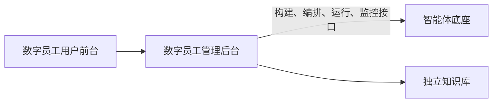

# 数字员工产品需求规划文档

- 版本：v0.1 逐章编写稿
- 编写日期：2026年9月9日
- 目标客户与用户：高校及高校教职工
- 目录依据：AI数字员工产品需求规划文档核心撰写维度（AI产品经理版）
- 当前讨论位置：第十二章 商业化与价值复盘（补充稿已完成，商业交付方式与费用说明范围沿用已确认内容，新增价值复盘机制待整体审阅）；具体指标细则、目标值及商务条件留待后续方案明确

本文按照附件的十二章及其小节逐项编写。正文先记录本次讨论已经确认的内容，尚未确定的部分标记为“待讨论”，每次确认后更新对应章节。文中的建设目标和产品要求不代表当前系统已经实现或完成验证；模板中的示例不自动纳入本产品范围。

本文以需求规划为编写粒度，优先明确各章节的目标、功能范围、主流程、职责边界与验收方向。后续按章节或小节确认整体内容；场景参数、页面字段、接口和异常分支等实施细则留待详细设计，不作为本轮逐项追问或阻塞后续章节的事项。已经确认的规则继续保留，尚未确认的细则不默认采用。

## 一、项目背景与需求初衷（定位顶层价值）

### 1. 行业与业务现状

本项目面向高校教职工，拟通过数字员工平台连接学校及外部多个系统，使教职工能够使用不同专业能力的智能体处理日常工作。平台以提高工作效率和结果可靠性为建设方向，支持教职工通过统一入口提出目标，并在明确的数据安全边界内使用相关系统与智能体能力。

学校与个人在使用过程中积累的知识、工作成果和专家能力，应当能够在各自的权限范围内得到整理、维护和复用，为后续工作提供持续积累。

目前行业内的workbuddy和codex和豆包work的还是面向C端进行日常办公/创作。

我们"数字员工"的产品形态是除了个人日常自用，核心是链接组织架构、各部门业务系统进行业务流程跑通，让"组织+人+业务"在一个产品上进行体现。

### 2. 核心建设目标

本项目以帮助高校教职工更高效、更可靠地完成日常工作为首要目标，以校内数据不出校为建设约束，通过统一的数字助理入口、专家智能体与专家团协作，以及对学校和外部系统的受控连接，减少重复操作与人工衔接，提高工作效率和结果质量。

学校通过统一配置与授权管理数字员工的服务能力，并通过应用层业务记录和用户 Token 用量记录了解使用情况。在持续使用中，按照学校与个人各自的权限范围，积累可维护、可复用的知识、工作成果和专家能力，形成长期价值。

| 目标层次 | 已确认的建设方向 |
| --- | --- |
| 首要目标 | 帮助高校教职工更高效、更可靠地完成日常工作 |
| 建设约束 | 首期采用校内私有化部署，校内数据的存储与处理均不出校；具体数据分类、外部系统调用边界及验证方式在第八章进一步明确 |
| 实现手段 | 统一数字助理入口、专家智能体与专家团协作、学校及外部系统的受控连接 |
| 长期价值 | 在各自权限范围内沉淀学校与个人可维护、可复用的知识、成果和专家能力 |

待讨论：提效、质量和成本的具体衡量方式及基线。量化目标在第十章确定，当前不填写未经验证的比例或数值。

### 3. 适用业务场景范围

本期文档聚焦通用平台能力，明确数字员工用户前台、数字员工管理后台、智能体底座与独立知识库之间的职责和协作要求。

| 范围 | 编写边界 |
| --- | --- |
| 数字员工用户前台 | 以当前 AI Employee OS 项目的客户端作为前台参考，定义数字助理、专家及专家团的使用需求 |
| 数字员工管理后台 | 以 AI PM Workbench 的数字员工后台作为参考，提供数字助理、专家智能体与专家团的创建、配置、测试发布和业务运行监控入口，通过接口调用底座完成相应操作 |
| 智能体底座 | 即智能体构建与运行平台，由同事开发，负责智能体的构建、编排、运行和监控，通过能力接口供数字员工管理后台调用；本文明确所需能力及协作边界 |
| 独立知识库 | 与智能体底座并列的独立产品，负责资料管理和检索召回；本文明确数字员工管理后台所需的调用能力及协作边界 |
| 具体业务场景 | 本文仅以会议场景说明会前地点、时间与人员空闲匹配、发起人确认、邀请与人工参会确认、已确认人员的会前提醒，会中录音与人工确认，以及会后差异化摘要、人工审核和下发的完整流程；学校具体业务规则和专业流程另行细化，不展开其他场景 |
| 平台价值验证 | 以会议完整流程验证教职工能够从提出目标走到获得可核验结果；具体样例数据及验收标准待后续确定 |

当前项目和后台资料用于参考，不代表本次规划的各产品协作已经接通或完成验证。

### 4. 利益相关方

平台同时服务于学校整体的建设目标、部门的业务与管理要求，以及教职工的日常工作需求。学校整体作为组织层面的利益主体列在首位，具体操作角色与权限在后续章节定义。

| 利益相关方 | 核心诉求与预期价值 | 主要职责 |
| --- | --- | --- |
| 学校整体 | 提升学校整体工作效率和服务质量，保障校内数据安全，沉淀可持续复用的学校知识、成果和专家能力 | 明确建设目标与投入方向，统筹学校层面的建设要求并评价整体成效 |
| 信息化部门 | 平台稳定可用，系统连接、能力供给、访问权限及安全要求得到统一管理 | 牵头建设和管理平台，负责平台及安全治理，组织系统接入与运行管理 |
| 各业务部门 | 智能体处理过程符合本部门专业规则，结果满足业务要求 | 提供专业规则与验收要求，负责专业要求和结果判断；获授权人员可配置和测试本部门的专家及专家团 |
| 教职工 | 更高效、更可靠地完成日常工作，在本人权限范围内使用资料与智能体能力并积累个人成果 | 发起本人工作，提供必要信息，参与关键决定和必要确认，核对工作结果 |

学校侧按“信息化部门牵头建设和管理平台、连接及权限，各业务部门提供专业规则与验收要求并由获授权人员配置和测试本部门专业能力，教职工使用”的分工规划。具体数据安全职责和投入决策机制，分别在第八章和第十二章进一步明确。

## 二、用户分析与核心痛点（精准匹配需求）

### 1. 核心用户画像

用户分为业务使用用户、平台管理用户和学校决策用户。业务使用用户按照工作职责细分为教学科研人员、院系行政人员和职能部门工作人员；同一个人可以兼任多类职责。

| 用户类别 | 核心用户 | 职责与工作特点 | 平台使用目标 |
| --- | --- | --- | --- |
| 业务使用用户 | 教学科研人员 | 围绕教学与科研开展专业资料获取、理解、整理和成果编写等工作 | 使用专业智能体辅助处理资料与形成成果，提高工作效率和结果质量，并在个人权限范围内积累可复用内容 |
| 业务使用用户 | 院系行政人员 | 围绕院系日常事务开展信息整理、材料处理和工作衔接，连接教职工与相关职能部门 | 减少重复操作和跨系统衔接，了解处理进度，核对工作结果并完成本人必要确认 |
| 业务使用用户 | 职能部门工作人员 | 在部门职责范围内处理专业业务，关注工作规则、办理要求和结果规范 | 使用符合部门专业要求的智能体能力，提高处理效率与结果一致性，并参与必要的业务判断 |
| 平台管理用户 | 信息化部门的平台管理人员 | 牵头平台建设与管理，组织系统接入、能力配置和运行管理，承担平台及安全治理职责 | 统一管理智能体能力、系统连接和访问权限，查看应用层业务记录及用户 Token 用量，保障服务可用与数据安全 |
| 平台管理用户 | 获授权的业务部门配置人员 | 熟悉本部门业务要求，在授权范围内维护专业能力配置 | 直接配置和测试本部门的专家及专家团，使能力符合业务需要 |
| 学校决策用户 | 学校层面的建设与投入决策人员 | 从学校整体角度关注建设方向、资源投入、应用成效与持续发展 | 了解平台对教职工工作效率、结果质量、数据安全及学校资产积累的价值，为持续投入与建设调整提供依据 |

各业务部门的专业规则提供与验收责任沿用第一章第4节的分工。画像按职责组织，具体人员可以兼任使用、业务验收或管理职责，操作权限在后续章节定义。

以上用户分类已经确认，工作特点和使用目标用于产品规划，后续结合实际用户调研核实与补充。

### 2. 核心痛点拆解

本节采用以下六项痛点作为需求分析的工作假设。优先解决“重复操作与系统衔接”和“工作结果难以直接采用”，对应第一章确定的工作效率与结果可靠性目标；校内数据安全作为建设硬约束，其余问题支撑易用性、统一管理和长期复用。

| 核心痛点 | 需要验证的具体表现 | 主要涉及用户 | 处理定位 |
| --- | --- | --- | --- |
| 重复操作与系统衔接 | 完成一项工作需要反复查找、整理、录入和跨系统传递信息，仍依赖人工衔接各步骤 | 三类教职工使用用户 | 优先解决，提高工作效率 |
| 工作结果难以直接采用 | 需要人工核对依据、补齐遗漏、汇总多个结果并完成后续操作 | 三类教职工使用用户、业务验收人员 | 优先解决，提高结果可靠性 |
| 校内数据使用受限 | 希望借助 AI 处理校内资料，同时担心数据外发或越权访问 | 教职工、平台管理用户、学校决策用户 | 建设硬约束，明确并验证数据与授权边界 |
| 专业 AI 能力不易使用 | 用户需要自行寻找工具、组织提示词、提供专业背景和业务要求 | 三类教职工使用用户 | 支撑易用性，降低能力发现与使用门槛 |
| 学校难以统一治理 | 智能体、系统连接、使用权限、应用层业务记录和用户 Token 用量分散，管理与维护成本不清楚 | 平台管理用户、学校决策用户 | 支撑统一管理，明确配置、权限、业务处理及使用消耗情况 |
| 工作成果与经验难以复用 | 历史资料、个人经验和部门方法缺乏有效整理，后续工作仍需重新积累 | 教职工、各业务部门、学校整体 | 支撑长期复用，持续积累可维护的知识、成果和专家能力 |

以上痛点分类与主次已经确认，具体表现仍需通过实际工作观察和用户调研验证。后续补充发生频率、影响范围、原有处理方式和对应证据，不将规划假设视为已完成的调研结论。功能所属版本及量化目标分别在第九章和第十章确定。

### 3. 用户核心诉求提炼

围绕工作效率与结果可靠性的首要目标，将教职工、平台管理人员及学校决策人员的核心诉求归纳为以下五项。具体功能与实现方式在后续章节展开。

| 核心诉求 | 用户希望获得的结果 |
| --- | --- |
| 容易找到并使用专业能力 | 表达工作目标后获得合适的专家支持，也能自主选择专家或专家团 |
| 减少重复操作与人工衔接 | 在授权范围内使用相关系统能力，协助完成工作中的具体步骤 |
| 掌握进度并获得可靠结果 | 知道当前进度、需要本人处理的环节，获得符合要求且可核验的成果 |
| 安全使用并持续复用资料 | 在明确权限和数据边界内使用校内资料，积累和复用学校及个人资产 |
| 统一管理并评价建设成效 | 学校能够管理能力、连接和权限，通过应用层业务记录及用户 Token 用量了解使用情况，为评价应用成效与资源投入提供依据 |

## 三、产品整体定位与核心能力定义（明确产品边界）

### 1. 产品定位

本产品是面向高校、服务教职工的数字员工工作平台。以数字助理为统一会话入口，以专家智能体和专家团提供专业处理与协作能力，在学校授权和校内数据不出校的约束下，连接学校及外部系统，协助教职工完成日常工作并获得可核验的结果。

数字员工平台负责应用层的用户交互，学校通过管理后台完成能力、连接和权限的配置操作，并查看应用层业务记录和用户 Token 用量。数字助理、专家智能体和专家团均通过底座能力接口构建、编排、运行和监控，普通问答与闲聊也由底座运行数字助理完成。底座负责实际模型调用及技术监控。产品在持续使用中，按照学校与个人各自的权限范围，支持积累可维护、可复用的知识、工作成果和专家能力。

### 2. 核心能力定位

产品面向用户提供的核心能力归纳为以下六项，承接前两章确定的建设目标与用户诉求。数字员工平台提供应用层交互并记录业务与用户 Token 用量，数字助理、专家智能体和专家团的构建、编排、运行和监控统一使用底座能力，具体职责以本章第3节为准。

| 核心能力 | 产品定义 |
| --- | --- |
| 自然语言交互与目标理解 | 通过底座运行数字助理，支持普通问答、闲聊及工作目标识别 |
| 专家处理与团队协作 | 单个专家独立处理问题，专家团由队长组织固定成员协作，实际编排与运行由底座承担 |
| 系统连接与授权执行 | 通过底座运行智能体，在授权及数据安全边界内使用学校、外部系统能力，应用层呈现操作过程与结果 |
| 过程查看与结果交付 | 展示底座返回的工作进度、必要确认、结果检查情况及可核验成果 |
| 统一配置与运行治理 | 后台提供能力、连接和权限的配置交互，记录应用层业务及用户 Token 用量；智能体技术运行与监控由底座负责 |
| 知识与成果积累复用 | 按学校和个人的权限范围，持续整理、维护和复用有价值的资料与成果 |

其中，数字助理、专家智能体与专家团的定义和职责如下。

| 对象 | 已确认的定义与职责 |
| --- | --- |
| 数字助理 | 通过底座构建、编排、运行和监控，在统一会话入口回答普通问题并支持闲聊；对工作目标进行意图识别并匹配专家智能体或专家团 |
| 专家智能体 | 一个智能体解决一个明确的问题，可由数字助理匹配，也可被用户手动选择并独立使用；承接单专家任务后，由该专家直接与用户沟通 |
| 专家团 | 多个智能体协作解决一个明确的问题，可由数字助理匹配，也可被用户手动选择进行会话 |
| 队长（场景智能体） | 每个专家团设一名队长，在底座中运行，负责统筹分派任务、检查结果、统一对外沟通和交付结果 |
| 专家团成员范围 | 在后台预先确定，队长在已确定的成员范围内组织协作；成员在内部协作，对用户的沟通由队长统一承担 |

以上为产品整体能力框架，具体功能范围在第四章展开，各版本的交付安排在第九章确定。

### 3. 产品边界定义

数字员工平台包括数字员工用户前台和数字员工管理后台，负责应用层的用户交互，以及应用层业务记录和用户 Token 用量记录。用户前台对应当前项目客户端，统一向管理后台提交请求；管理后台分别对接智能体底座与独立知识库，向前台返回响应、业务进度、必要确认和结果，具体调用路径见第六章第1节。

首期采用校内私有化部署，校内数据的存储与处理均不出校。部署范围与服务关系见第六章第1节；学校及外部系统的连接也需遵守该数据边界。

| 层次 | 职责边界 |
| --- | --- |
| 数字员工平台应用层 | 提供会话、专家与专家团选择、创建配置、运行发起、业务过程查看和结果展示等交互；智能体能力统一调用底座接口，记录应用层业务及用户 Token 用量 |
| 智能体构建与运行平台底座 | 统一负责数字助理、专家智能体和专家团的构建、编排、运行和监控，承担实际模型调用及技术监控，并通过接口提供应用层所需信息 |
| 独立知识库产品 | 与智能体构建与运行平台底座并列的独立产品，提供知识库能力；数字员工平台通过接口调用，知识库自身建设与内部实现由该独立产品承担 |

数字助理的普通问答、闲聊和意图识别均在底座运行。专家团的成员和队长通过应用层配置，队长的任务分派、结果检查及交付逻辑同样在底座中运行。应用层展示配置、业务处理过程与结果，不另行实现智能体构建引擎、编排引擎、运行时或技术监控平台。

数字员工管理后台是管理员日常智能体管理的统一操作入口，提供创建、配置、测试发布和业务运行监控功能，通过底座标准接口执行相应操作并在本后台展示结果。管理员无需为上述操作在数字员工管理后台与底座平台之间切换。

数字员工后台的监控范围限定为应用层业务记录和用户 Token 用量记录。模型的具体调用参数及其他技术监控细节由底座负责，不纳入数字员工后台监控。

数字员工平台、智能体底座与独立知识库分别作为独立产品维护，通过标准接口通信和协作。底座与知识库并列，由数字员工管理后台分别对接所需能力。记忆与知识库分开设计。数字员工平台对知识库的规划限定为授权范围内的应用层交互与能力调用，具体接入操作和接口范围另行明确；知识库独立产品的职责不与数字员工的记忆需求合并。

模型统一由系统管理员通过数字员工管理后台接入和配置，首期限定接入校内运行的模型服务。用户在数字员工用户前台直接使用有权使用的数字助理、专家或专家团，前台不提供个人模型接入或模型选择功能。管理后台依据管理员配置向底座提供本次智能体运行所需的模型配置，由底座据此调用模型服务。模型 API Key 用于调用鉴权，具体凭据保管、传递与使用规则在第八章明确。

对于学校现有业务系统中的正式业务，原业务系统继续管理正式业务记录。数字员工平台通过服务调用协助办理、展示执行过程及结果，并依据原系统的记录和回执核验业务操作是否生效。

账号、身份及组织人员信息来自学校指定的外部唯一数据源，用户通过对接的身份认证服务登录。数字员工后台读取和展示外部部门、人员信息，负责为部门和人员配置本平台的角色与权限。账号、身份及组织人员基本信息的维护责任属于外部数据源。

本期通用平台与具体场景的编写边界以第一章第3节为准。各版本的交付范围将在第九章确定。

首期能力限制、不做范围及后续扩展方向，将在第九章确定后回填本节。

## 四、核心功能需求规划（产品核心落地内容）

### 1. 基础核心能力（通用底座）

本节描述应用层所需的通用服务及交互需求。数字助理、专家智能体和专家团的构建、编排、运行和监控统一使用底座提供的能力；应用层负责接口调用、信息呈现，以及业务和用户 Token 用量记录，职责见第三章第3节与第六章第1节。

账号与身份统一对接学校指定的外部唯一数据源，用户通过身份认证完成登录。数字员工后台基于外部部门和人员信息，为部门及人员配置本平台的角色与权限。

| 基础能力 | 已确认的产品要求 |
| --- | --- |
| 外部账号与身份来源 | 账号、身份及组织人员信息读取外部唯一数据源，以外部数据源的信息为准 |
| 身份认证登录 | 用户通过对接的身份认证服务登录，以认证后的身份使用平台 |
| 部门与人员信息展示 | 后台读取并展示外部部门、人员及组织关系，基本信息由外部数据源维护 |
| 角色与权限配置 | 在数字员工后台，以部门和人员为配置对象分配本平台的角色与权限 |
| 系统连接管理 | 后台维护可接入系统和使用范围，前台展示本人可用连接并完成必要的个人账号授权，实际业务调用由底座执行 |
| 平台消息提醒 | 在平台内提供消息提醒；需要人工介入时通知对应用户进入相关任务完成人机交互操作 |

平台权限分为以下三类。角色用于组合权限，部门和人员作为授权对象，由数字员工后台配置角色与权限。

| 权限类别 | 控制范围 |
| --- | --- |
| 能力使用权限 | 可以使用哪些数字助理、专家智能体和专家团 |
| 后台管理权限 | 可以进入哪些管理页面、执行哪些管理操作 |
| 数据访问权限 | 可以查看或使用哪些资料、成果、业务记录及 Token 用量记录 |

部门配置的角色和权限自动适用于该部门直接所属的人员。人员自动继承所属部门的授权，人员范围以外部唯一数据源中的部门归属为准。

部门授权支持覆盖下级部门。管理员在授权时明确指定是否包含下级部门，默认仅覆盖本部门直属人员。

| 部门授权范围 | 生效人员范围 |
| --- | --- |
| 仅本部门（默认） | 本部门直接所属的人员自动继承本次配置的角色与权限 |
| 包含下级部门 | 本部门及所有下级部门的人员按照授权范围自动继承本次配置的角色与权限 |

部门层级及人员归属均以外部唯一数据源为准。

部门继承授权与个人授权按照“允许权限合并、明确禁止优先”的规则生效。对于同一权限及其适用范围：

- 个人未单独配置时，沿用部门继承权限。
- 部门与个人的允许权限合并，个人单独允许可以补充相应权限。
- 任一适用的授权来源存在明确禁止时，该权限不可用，即使其他来源允许。

以下以同一专家的使用权限为例，说明合并结果。

| 部门继承授权 | 个人配置 | 最终生效结果 |
| --- | --- | --- |
| 允许 | 未单独配置 | 允许使用 |
| 未配置 | 允许 | 允许使用 |
| 允许 | 明确禁止 | 禁止使用 |
| 明确禁止 | 允许 | 禁止使用 |

平台收到外部身份或组织关系变更后，自动更新相应人员的生效权限。

| 变更情况 | 已确认的处理规则 |
| --- | --- |
| 收到人员部门归属变更 | 移除已不再适用的旧部门继承权限，按照新的组织关系重新计算继承权限，并应用已确定的授权合并规则 |
| 收到账号停用信息 | 阻止该账号登录及发起新的操作请求 |

账号停用或相关权限撤销时，进行中任务按第八章第3节已确认原则停止受影响的后续操作，任务状态依据底座实际反馈展示。具体角色和权限项在本章第4节展开，授权校验及变更传播要求在第六章和第八章明确。

学校及外部系统的连接由数字员工后台统一管理，前台供教职工选择和授权使用。

| 参与方 | 系统连接职责 |
| --- | --- |
| 数字员工后台 | 维护可接入的学校及外部系统、连接配置和使用范围 |
| 教职工前台 | 展示本人有权使用的连接，支持选择使用；涉及个人账号时，由本人完成授权 |
| 智能体构建与运行平台底座 | 在授权范围内，随智能体任务执行实际业务调用并提供处理结果 |

具体连接配置字段、接入条件和个人账号授权方式在本章第4节及第六章展开，外部连接的数据边界在第八章明确。

应用层业务记录按照用户实际处理事项组织。会话是沟通的容器，任务是其中需要完成的具体事项，专家或专家团是任务的处理方。会话与任务不是互斥的记录类别：一个会话可以不包含任务，也可以包含一个或多个任务。后台管理操作另外记录。

任务以“独立目标和交付结果”为划分依据，不以消息条数、智能体调用次数或是否有专家介入作为划分依据。

- 用户提出新的独立目标，并需要独立交付结果时，形成新的任务；同一会话中的多个任务分别记录进度、状态和结果。
- 对原目标补充材料、调整要求或修改交付结果，仍归属原任务，不因新增消息自动建立任务。
- 为同一目标开展的专家协作、成员分工和阶段性产出，归属该任务的处理过程，不因更换或增加处理成员自动建立新的用户任务。
- 普通问答、闲聊等未形成独立工作事项的内容保留在会话记录中，通常不单独建立任务。不能仅凭回答者是数字助理、专家或专家团决定是否建立任务。

以下以会议事项说明记录规则，具体功能要求见本章第2节，所属交付版本在第九章确定。

| 同一会话中的用户需求 | 记录方式 |
| --- | --- |
| 发起下周的部门会议，提醒参会人员，并在会后形成摘要下发 | 建立一个会议任务，记录完整目标、预期交付结果及处理进展 |
| 补充这次会议的时间、参会人员或录音 | 关联原会议任务，补充所需信息与资料 |
| 根据这次会议录音，面向不同参会人员形成差异化摘要，经人工审核后下发 | 继续完成原会议任务，分别记录摘要版本、接收人员及审核和下发结果，不因生成多个摘要版本自动建立新任务 |
| 另外发起一场独立的项目评审会议 | 建立另一个会议任务，分别记录会议信息、进度及交付结果 |

后台提供会话与任务两个关联的查看入口，任务可按业务场景分类查看。

| 记录对象 | 基础记录内容 | 查看关系 |
| --- | --- | --- |
| 会话记录 | 使用人、会话对象、使用时间、完整对话、关联任务及该会话的 Token 用量 | 查看一次会话中的沟通过程及所包含的任务 |
| 任务记录 | 使用人、所属会话、工作目标、预期交付结果、业务类型、承接专家或专家团、处理进度、状态、实际结果及该任务的 Token 用量 | 独立查看事项进展和结果，并关联原会话上下文 |
| 管理操作记录 | 操作人、操作对象、操作类型、时间及操作结果 | 独立查看后台配置、授权等管理操作 |

任务记录同时关联使用人和承接任务的专家或专家团，并记录该任务对应的 Token 用量。使用人和智能体执行对象分别记录。会话内可以出现多个处理对象，各任务分别记录其实际承接方。

Token 用量以底座返回的实际消耗为依据，由数字员工平台按任务、会话、使用人和部门关联记录与汇总，并关联运行所用模型，支撑后续模型用量与消耗管理。基础用量记录随 V1.0 的身份、组织人员与权限接入一并建设，在实际使用时产生，不推迟到 V2.0。

| 统计对象 | 已确认的统计口径 |
| --- | --- |
| 任务 Token 用量 | 汇总该任务内相关智能体的实际消耗，包括专家团队长、成员以及失败和重试过程中实际产生的消耗 |
| 会话 Token 用量 | 汇总该会话内各任务的用量，以及未归属任务的普通问答、闲聊和任务建立前沟通等实际用量；同一笔消耗只统计一次 |
| 用户 Token 总用量 | 按使用人汇总其实际消耗，同一笔用量即使同时关联会话和任务，也只计入用户总量一次，不将会话与任务的汇总值再次相加 |
| 部门 Token 用量 | 依据记录中的用户与部门关联汇总实际消耗，沿用统一计量与去重口径，查看范围遵守数据权限；具体部门归属及汇总规则留待详细设计 |

任务失败不代表用量为零；失败和重试仅记录底座返回的实际消耗。同一笔消耗在会话和任务中关联展示，不产生重复计量。

任务通过底座能力自动识别，目标和归属明确时自动建立或关联任务记录；存在歧义时先追问澄清，具体规则见本章第3节。以上均为应用层记录，模型调用参数等技术明细由底座负责。已记录任务的归属纠正方式、业务类型配置、记录补充字段和查看权限待进一步明确。Token 用量返回接口、关联与去重依据、返回时效及缺失或补报时的处理方式在第六章和第七章进一步确定。

### 2. 场景化业务功能（核心价值输出）

本节仅以会议场景作为规划级主流程示例，按照会前、会中、会后的完整过程说明数字员工平台如何支撑教职工完成会议事项，并明确关键人工介入节点。具体场景参数与异常分支留待详细设计。已确认的业务闭环为：

- **会前：发起会议 → 梳理需求并匹配地点、时间与人员空闲情况 → 发起人参考并确认会议信息 → 发送会议邀请 → 受邀人员人工确认是否参会 → 会前提醒已确认参会人员。**
- **会中：人工确认录音操作 → 获取会议录音 → 人工核对用于后续处理的录音资料。**
- **会后：按不同参会人员形成差异化摘要 → 人工审核摘要及接收对象 → 下发对应参会人员 → 记录下发结果。**

会议场景的目标是协助发起人完成会前空闲匹配、安排确认、邀请反馈与提醒，会中内容记录，以及会后针对不同参会人员的信息整理与传达。会议信息、受邀人员的参会决定、会议录音和摘要环节均设置人工确认或审核节点；智能体生成与处理的内容经相应确认后再进入后续环节。学校具体业务规则和专业流程另行细化，本节不展开其他业务场景；所属交付版本在第九章确定。

**触发与任务组织**

教职工通过数字助理提出会议目标，或直接选择会议专家团发起。数字助理按用户权限与目标匹配承接方，信息不足时通过追问明确需求；会议专家团由预先配置的队长和成员协作处理，队长负责分派、检查与交付。智能体的识别、编排与运行统一调用底座能力。

从会议发起到摘要下发，围绕同一会议目标的各阶段归属于同一个任务。任务关联使用人、所属会话、空闲匹配结果、已确认的会议信息、邀请发送及人员反馈、提醒记录、录音资料、差异化摘要及其接收人员、人工确认与审核记录、处理进展、下发结果及 Token 用量。阶段切换、成员分工或补充信息不自动产生新的独立任务；同一会话中另行发起不同会议时，分别建立任务。面向不同参会人员的摘要属于同一会议任务的多份交付结果，不因摘要版本不同而拆成多个独立任务。

**执行流程与输入输出**

| 阶段与环节 | 触发条件与输入 | 场景功能与输出 | 异常处理及人工介入 |
| --- | --- | --- | --- |
| 会前：发起会议 | 教职工表达办会目标，提供已知的会议需求 | 识别会议意图与预期交付，建立会议任务并关联承接专家团 | 目标不清或无法判断是否属于已有会议时，先追问；没有合适承接方时的处理沿用本章第3节后续确定的规则 |
| 会前：空闲匹配与参考方案 | 用户提供的会议主题、期望时间或时间范围、拟邀人员、地点需求等信息 | 在授权范围内，通过底座查询相关日程与场地占用情况，匹配可选时间和地点，展示人员空闲、已知冲突及候选安排，供发起人参考选择 | 必要条件不足时追问；无法查询或数据不足时标明未知，不视为空闲；存在冲突时向发起人展示，由其调整需求或安排，不自动替其决定 |
| 会前：会议信息确认 | 会议需求、空闲匹配结果、发起人的选择与补充 | 梳理并展示会议主题、时间、地点或线上方式、拟邀人员等信息，由发起人核对、修改并确认，形成发送邀请的依据 | 必要信息缺失或尚未确认时，不按推测的安排发送邀请；会议信息必填项与具体交互待讨论 |
| 会前：发送会议邀请 | 发起人已确认的会议信息与拟邀人员名单 | 在授权范围内，通过底座调用邀请渠道向拟邀人员发送会议信息和邀请，分别记录发送对象及实际发送结果 | 无有效接收对象或部分发送失败时，展示受影响人员和原因；发送成功仅表示渠道返回相应结果，不代表该人员已确认参会 |
| 会前：人工参会确认 | 受邀人员收到会议邀请 | 由受邀人员本人手动反馈是否参会，将人工确认结果关联到本次会议和该人员，并向发起人展示反馈情况 | 未回复保留待回复状态，不默认确认参会；不能参会或持续未回复时如何推进会议安排，待进一步确定 |
| 会前：系统提醒 | 会议开始前到达提醒时点，且会议有效、人员已确认参会 | 系统依据当时有效的已确认参会名单自动发送会前提醒，展示会议时间、地点等已确认信息，记录提醒对象、时间、内容及渠道返回结果 | 未确认或已表示不能参会的人员不纳入会前提醒；信息变更、会议取消或参会确认撤回时，待发送提醒需更新或停止。提醒时点、频次、渠道与失败恢复规则待讨论 |
| 会中：会议录音 | 会议进行、可用的音频来源及人工确认的录音操作 | 获取会议录音并关联对应任务，展示录音资料及状态；由人工核对录音是否对应本次会议、资料是否可用及用于摘要的范围 | 未获得录音、录音不可用或资料核对未通过时，说明情况并由人工补充或处理，不直接将其作为已确认的摘要输入；录音来源、具体启停操作与中断恢复规则待讨论 |
| 会后：生成差异化摘要 | 人工确认的录音资料、会议信息及不同参会人员的摘要需求 | 调用底座的音频处理与内容生成能力，面向不同参会人员形成对应的摘要草稿，关联每份摘要的接收对象并展示供审核 | 无法辨识、缺失或存在歧义的内容需标明并澄清，不补写未经依据支持的会议事实；差异化依据不明时先明确要求，不擅自推断人员需求或扩大可见范围 |
| 会后：人工审核摘要 | 差异化摘要草稿及对应接收对象 | 人工核对会议事实、摘要内容与接收人员的对应关系，支持修改或要求重新生成，形成审核通过的摘要 | 未通过审核的摘要不得下发；修改或重新生成后的内容须重新确认，不能沿用旧内容的审核结果。审核责任人及逐份或批量审核方式待讨论 |
| 会后：下发与结果反馈 | 经人工审核的摘要及其接收对象、可用的下发渠道 | 在相应授权范围内，通过底座调用渠道能力，将对应摘要下发给对应参会人员，分别记录摘要版本、对象及渠道返回结果 | 无有效接收对象、渠道不可用或部分下发失败时，记录受影响对象及原因，不将全部下发标为成功；补发、重试及成功判定依据待讨论 |

**空闲匹配、邀请与提醒规则**

- 地点、时间与人员空闲匹配基于可访问的实际日程或占用数据，并说明结果依据和无法确认的部分。匹配结果供发起人参考，不能将空闲查询等同于会议室已预约或人员已承诺参会；是否通过既有业务系统提供场地预约能力留待场景详细设计，数字员工平台不自行建设会议室预约管理系统。
- 会议信息由发起人确认；收到邀请后的参会决定由受邀人员本人确认。拟邀名单、邀请发送结果与参会确认结果分别记录，不互相替代。
- 会前提醒仅面向当时有效的已确认参会人员，按会议开始时间触发相应提醒安排。提醒功能不将未回复人员视为已确认，也不自动承担邀请催办；是否催办及相关规则待讨论。
- 改期、地点调整、名单变化或会议取消影响后续邀请与提醒时，需依据最新有效的安排处理；是否需要重新征求参会确认、如何处理已有反馈，待进一步明确。

**人工确认与差异化摘要规则**

- 会议信息、录音和摘要的人工确认或审核是本场景的明确要求。应用层展示待确认内容并接收人工决定，底座中的处理流程应等待对应决定，不绕过尚未通过的确认继续执行依赖该结果的环节。
- 记录确认或审核的操作人、时间、对象、对应内容版本及结果。会议信息由发起人确认，参会决定由受邀人员本人确认；录音与摘要审核由哪些被授权人员承担，待进一步确定。
- 不同摘要应保持会议事实一致，内容不得超出接收人的授权范围。摘要应明确关联适用的参会人员，避免将某一人员对应的内容误发给其他人员。
- 差异化摘要的具体区分依据、内容结构和生成规则待讨论，不将组织职务、关注事项或个人待办等候选依据直接视为已确认规则。

上述流程明确产品需支持的处理环节，不代表日程与场地占用查询、会议邀请与反馈、提醒调度、会议录音、音频处理或下发渠道已经完成对接。会议对接场景在目标学校落地时，应具备相应业务系统及必要接入条件；依赖的业务系统不存在时，不开展该对接场景，具体启用前提按第六章第4节执行。

**职责边界**

| 参与方 | 会议场景中的职责 |
| --- | --- |
| 数字员工用户前台 | 提供会议发起、空闲匹配结果与候选安排查看、会议信息人工确认、邀请发送与人员反馈查看、参会确认及会前提醒等交互，以及录音控制与资料确认、差异化摘要展示与人工审核、下发结果查看入口；邀请确认的具体入口与录音交互随对接方案确定 |
| 数字员工管理后台 | 配置会议专家团及预先确定的成员范围，管理所需能力与连接的使用权限，查看应用层会议任务记录和用户 Token 用量 |
| 智能体构建与运行平台底座 | 构建、编排和运行会议相关智能体，提供意图识别、追问、日程与场地查询及匹配、人工确认后的流程继续执行、音频处理、差异化摘要生成，以及邀请、提醒和摘要的授权渠道调用等所需能力，并返回业务结果及实际用量 |
| 对接系统或服务 | 按授权提供日程与场地占用信息；在采用外部邀请、录音、提醒或摘要下发渠道时，按约定提供人员反馈、音频资料或发送结果；具体系统、接口与数据边界待确定 |

会议信息、日程与场地占用信息、邀请反馈、录音、提醒及摘要的处理均受校内数据不出校和相应访问权限约束。空闲数据的获取条件、邀请反馈的接收、提醒的定时触发与调度分工、人工确认结果的传递、音频处理、数据保存及发送渠道的具体方案在第六章至第八章明确，应用层不自行实现智能体运行或技术监控能力。

**结果记录与闭环要求**

- 会议任务应能关联查看空闲匹配结果、发起人已确认的会议信息、各受邀人员的邀请发送结果及人工反馈、已确认人员的会前提醒记录、录音资料、各节点的人工确认与审核记录，以及每份摘要对应的参会人员和下发结果。
- 生成摘要是中间成果；本场景的完整目标还包括完成相应人工审核，将对应摘要下发给确定的参会人员，并取得可核验的下发结果。
- 提醒与摘要下发状态依据实际渠道返回的信息展示。部分失败或结果未知时，保留真实状态，不以摘要生成成功代替整个任务完成；具体成功判定依据及提醒失败对整体任务状态的影响待进一步确定。
- 任务内队长、成员及失败重试的实际 Token 消耗，按照本章第1节的口径汇总并去重。

本节的规划主线、关键人工节点和交付范围已明确。上文尚未确定的场景配置、摘要细分规则、审核分工、对接渠道及异常处理分支统一留待后续场景详细设计，本轮不再逐项细化。已确认的人工参会反馈、提醒对象和差异化摘要要求继续保留；不将尚未确定的细则视为既定要求。

### 3. AI智能能力需求（差异化核心）

本节按整体能力范围组织，说明平台需要通过底座获得哪些 AI 能力。以下六项能力范围已确认，其中用户输入与资料理解覆盖文字、文档、表格、图片及会议音频。

| 能力方向 | 规划要求 | 确认状态 |
| --- | --- | --- |
| 用户输入与资料理解 | 理解自然语言输入，支持文档、表格、图片等工作资料的识别与理解，以及会议音频的内容理解 | 已确认 |
| 意图识别与追问 | 区分普通问答、新任务和已有任务补充；目标、资料或归属不清时，通过追问补齐必要信息 | 已确认 |
| 专家匹配与承接 | 在用户权限范围内匹配专家或专家团，明确时自动转交，候选无法区分时由用户选择 | 已确认 |
| 任务规划与多智能体协作 | 单个专家独立处理其能力范围内的问题；专家团队长在预先确定的成员范围内分派任务、检查并汇总结果 | 已确认 |
| 内容整理与生成 | 根据任务目标、授权业务资料与交付要求整理内容，支持会议音频形成摘要及面向不同参会人员的差异化交付 | 已确认；具体摘要规则留待场景详细设计 |
| 结果检查与人工介入 | 专家团由队长检查结果；会议场景保留已确定的人工确认与审核节点，应用层呈现待处理事项并接收人工决定 | 已确认；其他场景的具体人工节点不在本文展开 |

上述智能能力统一通过底座构建、编排和运行，数字员工平台提供应用层交互并展示返回结果。能力的准确性、响应时延与结果质量等量化指标在第六章和第十章明确；知识与记忆的范围及治理在第五章和第七章展开，不预设自动训练模型或未经授权的跨用户学习。

数字助理在底座中运行，可以在统一会话入口回答用户的普通问题并支持闲聊。对于用户表达的工作目标，数字助理通过底座进行意图识别，寻找适合处理该目标的专家智能体或专家团。用户也可以直接选择专家智能体或专家团发起会话。

意图识别与追问机制为必备能力，适用于数字助理入口及用户直接选择专家或专家团的入口。识别和追问通过底座运行相关智能体完成，应用层承接对话、根据返回结果建立或关联任务记录，并展示业务处理过程。

系统结合用户当前输入、会话上下文和已有任务的目标与交付要求，按以下规则识别和处理意图。

| 识别情况 | 已确认的处理要求 |
| --- | --- |
| 普通问答或闲聊，未形成独立工作事项 | 通过底座响应，保留会话记录，通常不建立任务 |
| 新的独立目标和预期交付结果明确 | 自动建立任务记录，并进入相应的专家或专家团匹配、承接流程 |
| 明确是在补充或修改已有任务 | 自动关联原任务，补充其要求或材料，不重复建立任务 |
| 一次输入包含多个独立目标和交付结果 | 分别识别任务并记录；不因来自同一条消息而合并为一个任务 |
| 目标、交付要求或任务归属不清 | 先向用户追问，明确后再建立或关联任务；不默认归入最近一个任务 |

追问机制覆盖任务识别和后续处理过程中出现的信息缺口。

- 目标或交付要求不清时，追问需要完成什么、交付什么；缺少必要资料或业务条件时，追问对应缺口。
- 同一会话存在多个任务，且无法确定用户在补充哪个事项时，澄清所指任务后再关联。
- 结合已有上下文发起有针对性的追问，不重复询问用户已明确提供且仍有效的信息；用户补充后继续识别和处理。
- 对依赖缺失信息或未确定前提的处理，先澄清再继续，不将推测当作用户已确认的要求。

信息充分且归属明确时自动记录，不要求用户逐次确认任务分类。自动建立或关联任务记录不等于取得业务操作授权，实际执行仍遵循平台与业务系统的权限及必要确认规则。

数字助理识别目标后，在用户有使用权限的专家或专家团范围内进行匹配。匹配结果明确时，通过底座自动转交，并在前台展示承接该任务的专家或专家团；存在多个候选且无法明确区分时，由用户选择后再转交。该规则适用于数字助理匹配入口，用户直接选择专家或专家团时仍沿用手动选择入口。

专家团由队长负责统筹，队长向预先确定的成员分派任务、检查处理结果，并统一对外沟通和完成结果交付，成员在内部协作。单个专家智能体能够独立承接其能力范围内的问题，并直接与用户沟通。专家智能体与专家团的构建、编排、运行及监控由底座提供，应用层负责发起请求、承接用户交互并展示过程与结果。

本节整体能力范围已确认。具体文件格式与处理限制、专家匹配规则、用户未回应追问或无法匹配时的处理、任务归属纠正等实施细则留待详细设计；底座实际支持情况在第六章验证，质量要求与评价方式按后续章节继续编写。

### 4. 管理后台功能

本节按管理模块明确后台的整体功能范围。以下六个管理模块已确认，范围包括数字助理、专家及专家团的统一配置与测试发布，以及授权范围内的知识与资产管理。

| 管理模块 | 已确认的规划级功能范围 |
| --- | --- |
| 智能体管理 | 统一提供数字助理、专家智能体与专家团的创建、配置、测试发布和业务运行监控入口，维护专家团的队长及固定成员范围；管理后台通过接口调用底座能力并展示操作结果，实际构建、编排、运行和技术监控由底座提供 |
| 组织与权限管理 | 读取外部唯一数据源中的部门和人员信息，维护本平台角色、能力使用权限、后台管理权限及数据访问权限，按已确认规则继承和合并授权 |
| 系统连接管理 | 管理学校及外部系统的接入配置和使用范围，向前台提供用户有权使用的连接，承接必要的个人账号授权 |
| 知识与资产管理 | 提供授权范围内的知识与成果使用、管理交互，知识库相关能力调用与底座并列的独立知识库产品，支持对话成果经用户确认内容与有权写入的归属范围后入库；记忆单独设计并按第五章已确认规则分层管理，具体知识库操作入口与接口范围待讨论 |
| 业务记录管理 | 关联查看会话、任务、人工确认与审核、结果交付及管理操作记录，了解业务处理进度与结果 |
| Token 用量统计 | 按用户、部门、会话和任务查看用量，依据底座返回的实际消耗，沿用已确认的归集与去重规则；V1.0 建立基础用量记录，V2.0 增加模型用量与消耗管理，具体管理能力见第九章 |

数字员工管理后台提供完整的智能体管理操作界面，管理员在本后台完成创建、配置、测试发布及业务运行监控，无需切换到底座平台操作。创建专家团时，预先确定成员范围，并明确其中的队长（场景智能体）。

后台配置由信息化部门与获授权的业务部门人员按职责分工使用：信息化部门负责平台、系统连接和权限管理，业务部门人员在授权范围内配置和测试本部门的专家及专家团。具体分工见第五章第3节，授权规则沿用本章第1节。

系统管理员在数字员工管理后台统一接入模型，并为数字助理、专家及专家团配置运行所需模型。用户在前台直接使用相应能力，前台不提供模型接入与选择功能。运行时管理后台依据管理员配置向底座传递模型配置，底座按配置执行调用；具体模型管理入口的菜单归属和配置字段留待详细设计。

后台将用户配置及操作请求提交到底座，通过底座能力接口完成实际构建、编排、运行和监控。后台的监控功能只负责应用层业务记录和用户 Token 用量记录，不涉及模型的具体调用参数等技术细节。业务记录提供会话和任务两个关联的查看入口，一个会话可以包含多个任务；任务按独立目标和交付结果划分，可按业务场景分类查看。管理操作另行记录。基础字段、任务划分及 Token 统计口径以第四章第1节为准，其中任务记录包含使用人及该任务的 Token 用量，按底座返回的实际消耗统计，并在会话、任务与用户汇总中避免重复计量。

后台同时提供部门和人员的角色与权限配置入口。部门、人员及其基本信息读取外部唯一数据源；管理员在后台维护本平台的角色与权限配置，身份与组织基本信息在本平台只读展示。角色用于组合权限，三类权限的控制范围与授权生效规则以第四章第1节为准。

后台统一管理学校及外部系统的可接入清单、连接配置和使用范围，向教职工前台提供本人可用的连接。涉及个人账号的连接，由本人在前台完成授权，实际业务调用通过底座随智能体任务执行。

本节整体模块范围已确认。配置字段、具体管理角色、测试与发布操作规则、生命周期细则、业务类型配置、记录补充字段及统计筛选方式留待详细设计。知识与资产治理、底座与模型服务接入和凭据管理按第五章至第八章进一步确定。

## 五、交互与体验需求（拟人化、低门槛）

本章围绕自然交流、过程可见、配置易用、反馈清楚和记忆可控，明确已确认的五项整体体验要求。会话入口、专家匹配、任务关系和人工确认要求继续沿用，页面布局与具体操作细则留待详细设计。

### 1. 拟人化交互

用户可以直接与数字助理进行普通问答和闲聊。发起工作目标时，前台支持两种使用方式：用户通过数字助理统一会话入口提出目标，由数字助理匹配专家智能体或专家团；用户也可以手动选择专家智能体或专家团进行会话。

任务由专家或专家团承接后，持续沟通的责任按任务承接方式确定，适用于手动选择和数字助理匹配两种入口。

| 任务承接方式 | 持续沟通要求 |
| --- | --- |
| 单专家任务 | 由该专家直接与用户沟通，负责追问、反馈进度和交付结果 |
| 专家团任务 | 由队长统一与用户沟通，汇总需要补充的信息、反馈进度并交付结果；成员在内部协作 |

数字助理匹配明确且用户有使用权限时自动转交，前台展示任务承接方；多个候选无法明确区分时，前台支持用户选择后转交。匹配与承接规则以第四章第3节为准。

教职工在前台查看和选择本人有权使用的系统连接；涉及个人账号时，由本人完成授权。可用连接及使用范围由后台统一维护。

以自然语言会话作为主要交互方式，支持用户提供文字、文档、表格、图片及音频资料，并通过清楚的追问、选项或确认操作补齐信息。用户能够知道当前正在处理哪个任务、由谁承接，以及何时需要本人决定，无需了解智能体内部配置即可使用。

会话组织、承接方与候选项的具体呈现方式，以及手动选择后目标超出能力范围时的操作方式留待详细设计。

### 2. 可视化流程

应用层展示底座提供的业务处理进度、必要确认、结果及失败反馈。底座负责技术监控，应用层的后台监控范围遵循第三章第3节。具体展示粒度、用户可见范围和交互方式待讨论。

会议场景按会前、会中、会后展示业务进展。会前向发起人展示地点、时间与人员空闲情况及候选安排，分别呈现会议信息确认、邀请发送、受邀人员人工反馈和已确认人员的提醒结果；会中与会后呈现录音、摘要的待确认或审核状态，以及各摘要的接收对象和下发结果。具体规则以第四章第2节为准。

按任务组织进度展示，使用户能够区分同一会话中的多个事项，查看各自的处理阶段、当前承接方、待人工处理内容及交付结果，并返回相关会话上下文。具体展示形式留待详细设计。

用户离开会话或关闭客户端后，任务按底座可独立执行的范围继续处理。离开页面或关闭客户端本身不代表取消任务。

| 情况 | 已确认的处理要求 |
| --- | --- |
| 工作已提交底座，且能够独立执行 | 由底座继续运行，不要求用户持续停留在会话或保持客户端打开 |
| 执行到需要人工确认的环节 | 等待相应人工决定，不绕过确认继续执行依赖该决定的操作 |
| 依赖暂不可用的本机能力 | 停在对应环节等待，并说明所需条件；不将依赖本机录音、文件获取等能力的工作显示为仍可正常继续 |
| 用户再次进入 | 关联原任务，查看最新进度、待办和结果，并继续处理待完成事项；不因重新打开会话而重新创建或重复提交任务 |

应用层负责恢复任务的可见进度与交互，任务持续执行及等待后继续处理的能力由底座提供。本机能力的可恢复范围、底座状态返回及客户端重新进入后的衔接条件在第六章验证，具体实现留待详细设计。

用户在任务操作权限范围内，可以主动暂停、继续或取消正在执行的任务。应用层提供控制入口，将操作请求提交底座，并根据实际返回结果更新任务状态，不以用户已点击操作代替控制已经生效。

| 控制操作 | 已确认的产品要求 |
| --- | --- |
| 暂停 | 通过底座暂停任务的后续执行，保留原任务上下文、已完成进展及结果，展示实际暂停状态 |
| 继续 | 在底座返回的可继续状态下推进原任务，不另建任务或重复执行已完成的业务操作；必要的权限和人工确认仍需满足 |
| 取消 | 通过底座终止任务的后续执行，记录实际取消结果并保留已发生的业务记录；已发出的会议邀请、摘要等操作不会因取消任务而自动撤回 |

控制操作及实际生效结果关联原任务记录。具体可暂停节点、控制请求的生效时机和外部操作进行中的处理方式，由底座能力核验及详细设计明确，不将控制入口等同于可立即中断所有外部操作。

### 3. 低门槛配置

配置能力面向信息化部门的平台管理人员，以及获授权的业务部门配置人员。

| 使用对象 | 已确认的配置职责 |
| --- | --- |
| 信息化部门 | 负责平台、系统连接和权限管理 |
| 获授权的业务部门人员 | 配置和测试本部门的专家及专家团，由熟悉业务的人员直接维护专业能力 |

上述分工通过本平台角色与权限落实，业务部门人员按所获授权操作。具体管理角色、智能体发布权限及跨部门管理范围留待详细设计。

管理员通过可视化表单、对象选择和分步引导，完成智能体配置、专家团组建、权限分配、系统连接及资料管理；前台用户通过选择与必要授权使用已有能力。配置交互应帮助用户理解所需信息和配置结果，降低使用与管理门槛。

智能体配置、测试与发布操作通过底座能力接口完成，应用层承接配置输入和结果展示。是否采用或接入可视化流程编排界面另行评估，不将自建零代码或低代码编排引擎视为本章承诺。

### 4. 人性化反馈

目标、任务归属或必要资料不清时，通过追问引导用户补充；结合已有上下文，避免重复询问已明确提供且仍有效的信息。意图识别与追问的能力规则以第四章第3节为准。

资料缺失、内容冲突或识别不清影响业务处理时，提示具体疑点并转人工补充、确认或审核；依赖这些信息的业务动作等待处理结果，按第六章第3节已确认原则推进。

对正在处理、需要人工确认、已完成、失败或部分完成等业务情况提供清楚的反馈，说明当前结果、需要用户处理的事项及可行的后续操作。状态和结果以实际处理信息为依据，人工确认后再执行的事项应与已经执行的结果清楚区分。

依赖服务不可用且无法获取任务实时状态时，展示最后已知进度并提示状态待确认，连接恢复后核对实际状态。已保存内容的查看和未受影响功能的使用，按第六章第3节已确认原则处理。

任务异常时，依据底座实际返回的信息展示重试进度或转人工处理状态，并说明需要用户处理的事项；重试与人工兜底按第六章第3节已确认原则执行。

平台内提供消息提醒。任务执行到需要人工介入的节点时，通知对应用户进行人机交互操作，接收对象依据该节点需要参与的人员确定，不统一默认为任务发起人。

消息关联相应任务和待处理事项，用户可以由消息进入对应交互位置，完成补充信息、确认、审核等操作。仅阅读消息不代表已经完成相应人工决定。

应用层记录人工操作并将结果传回底座，由底座依据实际结果及后续执行条件继续处理，平台同步更新业务状态。人工操作尚未完成时，沿用第五章第2节的等待规则。消息呈现方式与具体交互细则留待详细设计。

具体提示内容、追问方式及异常恢复操作留待详细设计。

### 5. 记忆能力（后续专项设计）

支持会话与任务上下文的连续理解，减少用户反复说明同一目标和背景；在用户授权和数据权限范围内，支持长期保留个人偏好及可复用的工作信息，服务于后续任务。记忆需求包括系统自动识别与压缩、用户明确要求时写入，以及个人、部门、校级记忆和长期记忆的分层管理与衰退机制。

记忆与知识库作为不同对象分别设计和管理。记忆主要从用户与智能体的沟通中提取协作背景、偏好和习惯，服务于后续沟通与任务；知识库保存可检索、引用和复用的资料与成果，来源包括用户主动上传的资料及从对话中选择沉淀的成果。临时提供给任务使用的附件和全部聊天记录不自动转为知识库资料。

知识库由与底座并列的独立知识库产品提供，数字员工平台承接知识库相关的应用层交互并调用其能力。对话成果采用“系统建议沉淀、用户确认后入库”的方式：系统可提出候选内容，用户确认具体内容及有权写入的个人、部门或校级归属范围，再由数字员工调用知识库接口完成入库，并依据知识库返回结果反馈入库状态。个人长期记忆的自动写入授权不直接作为知识库入库授权。

| 记忆能力 | 已确认要求与待明确边界 |
| --- | --- |
| 自动识别与压缩 | 经用户授权后，系统自动识别并压缩可复用信息，直接写入个人长期记忆，无需逐条再次确认；用户继续拥有查看、纠正和删除能力 |
| 用户明确要求时写入 | 用户明确告知数字助理需要记住的信息时，支持在其授权范围内写入记忆 |
| 分层管理 | 按归属范围与保留周期两个维度组织：归属范围包括个人、部门和校级，保留周期区分短期与长期；可形成个人长期记忆、部门长期记忆和校级长期记忆等组合，具体期限留待详细设计 |
| 共享记忆写入与维护 | 部门记忆由获授权的业务部门人员管理，校级记忆由学校指定的管理人员负责；系统或用户可提交候选内容，经对应管理人员审核后写入共享记忆 |
| 衰退机制 | 对长期未使用、与当前工作相关性降低的记忆，逐步降低引用优先级；明确过期、被纠正或被新信息替代的旧记忆停止参与后续回答；个人记忆由用户删除，共享记忆由对应管理人员删除，具体衰退周期与判断参数留待详细设计 |

学校、部门共享记忆与个人记忆分别遵守相应的授权和使用范围，不因自动识别或压缩而扩大访问权限，也不默认将个人内容共享给其他人员。

自动写入个人长期记忆的授权不等于获得部门或校级共享记忆的写入权限。共享记忆按上述责任分工审核与维护，审核通过的内容仍受对应归属范围和数据权限约束。长期记忆仍受有效性与衰退规则管理，不能将长期保留等同于内容永久有效。

个人长期记忆由用户可控，提供查看、纠正和删除入口。个人记忆的管理与业务记录的留存分别定义，不能将记忆删除等同于业务记录或原始资料同步删除。

记忆衰退采用“降低引用优先级、失效后停用、删除由人控制”的原则。降低引用优先级和停止使用分别影响后续记忆使用，不等同于删除记忆内容；不因使用频率低而自动删除仍有价值的记忆。具体衰退周期和判断参数留待详细设计。

上述记忆能力需求、个人长期记忆自动写入及用户控制方式、共享记忆的审核与管理分工、记忆衰退原则、记忆与知识库分开设计的边界，以及对话成果经用户确认后调用知识库入库的方式已确认。涉及模型推理的处理继续遵守底座运行边界；记忆服务的技术职责与处理流程在第六章第1节占位，留待后续专项设计。具体内容范围、留存和删除规则在第七章与第八章继续明确，不预设利用用户数据自动训练模型。

## 六、技术需求与可行性评估（AI产品核心风控）

本章从产品规划角度明确技术协作、指标方向、可行性验证和对接要求。四个小节的规划级内容已逐节讨论并整体确认，继续沿用应用层与底座的职责边界。具体技术选型、支持环境、接口字段和指标目标值依据能力核验与测试结果确定，不将规划要求表述为当前系统已具备的能力。

### 1. 核心技术架构

本节规划级内容已整体确认，包括校内私有化部署方式、服务分工、三个独立产品通过标准接口协作及分别维护版本的原则、用户前台经管理后台调用底座与知识库的路径，以及系统管理员统一配置模型、管理后台通过接口完成智能体创建与业务运行监控、底座执行实际能力的规则。管理员的日常智能体管理操作在数字员工管理后台完成。具体技术选型、接口规范、协议字段和实现方案留待详细设计；记忆服务保留占位，留待后续专项设计。

首期以校内私有化部署作为交付方式。数字员工管理后台、智能体底座，以及处理校内数据的模型服务，均在校内环境部署运行；数字员工用户前台连接这套环境使用。独立知识库接入安排在 V2.0，接入后同样在校内环境部署运行，不作为 V1.0 的交付依赖。校内数据的存储与实际处理均在校内完成，不将校内数据发送至校外模型或处理服务。具体部署拓扑、资源配置与运行条件留待技术方案及能力核验明确。

已确认的产品调用架构为：**数字员工用户前台 → 数字员工管理后台 → 智能体底座和独立知识库**。底座与知识库并列，由管理后台分别对接。

数字员工平台（包含用户前台和管理后台）、智能体底座与独立知识库是三个独立产品，各自维护自身能力与版本，通过标准接口通信和协作，分别发布与升级。兼容现有接口的版本可以独立升级；涉及不兼容变更时，先完成适配和联合验证，再更新校内部署环境。具体接口规范及版本兼容判定方式留待详细设计与联调方案明确。

上述“数字员工管理后台”包含管理操作入口及支撑用户前台请求的应用服务。管理后台承接前台请求，校验身份与权限，关联会话和任务，并按业务需要调用底座或知识库；依据返回结果记录应用层业务与实际 Token 用量，再将响应、进度、待人工处理事项和结果返回用户前台。具体接口和传输方式留待详细设计。

管理员的智能体创建、配置、测试发布及业务运行监控统一在数字员工管理后台完成。管理后台提供相应操作界面，通过标准接口调用底座的构建、编排、运行和监控能力，并在本后台呈现操作结果，日常智能体管理无需在两个平台之间来回切换。监控界面展示底座返回的业务运行状态、进度、待人工处理事项、交付结果，以及实际 Token 用量；模型调用参数等技术监控细节仍由底座负责。

| 系统 | 已确认的职责 |
| --- | --- |
| 数字员工用户前台 | 提供身份认证登录、数字助理会话、专家与专家团选择、运行发起、业务过程查看和结果展示等应用层交互；用户直接使用已配置的智能体能力，向数字员工管理后台提交请求，并展示其返回的业务信息 |
| 数字员工管理后台 | 作为统一管理入口，提供数字助理、专家与专家团的创建、配置、测试发布和业务运行监控功能，通过底座接口执行并展示结果；由系统管理员统一接入与配置模型；承接用户前台请求，维护并校验权限，关联会话和任务，向底座传递模型配置并调用独立知识库，记录应用层业务及用户 Token 用量，向用户前台返回业务信息 |
| 智能体底座 | 由同事开发，统一负责数字助理、专家智能体和专家团的构建、编排、运行和监控；接收本次运行选定的模型配置，执行实际模型调用及技术监控，通过接口向数字员工管理后台返回相应结果 |
| 独立知识库 | 与智能体底座并列，负责资料管理和检索召回，向数字员工管理后台提供可调用的知识库能力；具体接口能力和接入流程待核验 |
| 模型服务 | 统一由系统管理员在数字员工管理后台接入与配置，首期限定为校内运行的模型服务；由底座依据管理后台传入的模型配置和调用凭据执行调用，具体凭据管理方式留待安全设计 |
| 外部身份与组织服务 | 学校指定的外部唯一数据源提供账号、身份及组织人员信息，对接的身份认证服务支持用户登录；具体系统及接入方式待确定 |

数字助理的普通问答、闲聊、意图识别与专家、专家团任务统一通过底座运行。

**模型接入与运行配置**

| 环节 | 已确认的职责与使用方式 |
| --- | --- |
| 模型接入与配置 | 系统管理员通过数字员工管理后台统一接入校内模型服务，为数字助理、专家和专家团配置运行所需模型 |
| 前台使用 | 用户直接使用有权使用的数字助理、专家或专家团，前台不提供模型接入、选择或切换功能 |
| 配置传递与执行 | 数字员工管理后台根据管理员配置，将本次运行所需的模型配置提交到底座，由底座执行实际模型调用 |

模型接入、选择和配置集中在数字员工管理后台，用户前台使用管理员已配置的能力。具体配置字段、智能体与模型的配置关系及配置变更的生效细则留待详细设计；API Key 的保管与使用遵循第八章第1节已确认的凭证管理原则，具体存储、传递与更新机制留待技术设计，不预设必须传递明文凭据。

首期统一接入校内运行的模型服务，数据存储与实际处理均不出校。

在已有职责边界下核验端到端协作：身份与权限能否传递并生效，智能体配置与任务能否通过接口提交，业务进度、人工确认请求、结果及实际 Token 用量能否返回应用层，人工决定能否传回底座继续处理。技术监控保留在底座，应用层展示业务信息。

接口联调需验证管理员能够在数字员工管理后台完成智能体创建、配置、测试发布及业务运行监控的完整操作流程，所需能力由底座接口提供，不以跳转到底座平台操作代替本后台的功能交付。

需要人工介入的业务信息应能关联相应任务和处理用户，支撑平台内消息提醒、用户进入相应交互位置、提交人工决定及底座接收后继续处理的完整过程。具体接口与消息实现留待详细设计。

需核验客户端离开或关闭后底座独立运行任务的能力、人工确认及本机依赖不可用时的等待处理，以及用户返回时获取原任务最新状态和继续交互的能力。主动暂停、继续和取消任务需由底座提供控制能力及实际结果反馈。客户端恢复界面或继续任务不应重复发起原任务或重复触发已完成的业务操作。

身份认证与外部唯一数据源的接入方案、授权传递和校验方式、模型配置向底座传递及实际模型调用的接口、独立知识库产品的接口接入留待技术方案明确。知识库内部实现由独立知识库产品承担。模型统一由系统管理员在数字员工管理后台接入与配置，API Key 的保管、传递与使用遵循第八章已确认的管理原则及后续技术设计。

**记忆服务专项设计（占位，技术方案未定稿）**

保留当前讨论方向：数字员工平台负责前台聊天产生的记忆写入与管理；底座负责运行时的记忆读取、召回及上下文拼接组装。该方向作为后续专项设计的输入，暂不固化为已确认的技术职责或接口方案。知识库与底座并列，负责资料管理及检索召回的既有边界继续保留。

后续专项设计需明确记忆识别与压缩、候选内容生成、写入触发、存储与读取、召回与上下文组装、权限校验及生命周期管理的职责和协作流程，尤其是候选记忆由谁生成、如何交由相应服务执行写入规则。本轮仅占位，不继续拆解具体实现。

记忆接入的交付版本已安排为 V2.0，技术职责与实现方案仍保留专项设计占位。第五章已确认的分层、授权、个人记忆自动写入、共享记忆审核及衰退原则继续作为产品要求；专项设计在校内私有化部署和数据不出校的约束下完成，不将已有产品要求标记为待重新确认。

### 2. 关键技术指标（可量化）

本节规划级内容已整体确认，包括响应时效、任务执行成功率、智能处理质量、稳定性与可用性、容量与处理范围，以及业务记录与 Token 用量一致性。任务难度分层保留暂定占位；具体统计口径、基线、目标值、适用条件和测试规模，留待后续技术架构讨论、底座能力核验、代表性样例测试及第十章验收规划制定。

| 指标方向 | 测量内容 |
| --- | --- |
| 响应性能 | 普通问答衡量首次有效反馈和完整回答时间；专家与专家团任务按具体处理方、任务类型和任务难度分组，衡量首次进度反馈、各阶段处理耗时及最终交付总时长；系统处理与业务等待时间分别统计 |
| 任务执行成功率 | 衡量任务是否完成约定的业务目标与交付要求；具体统计口径和目标值后续制定 |
| 稳定性与可用性 | 按 7×24 小时服务进行规划，衡量应用与关键接口的可用情况、请求失败率及异常后任务状态恢复的一致性；具体可用率、故障恢复时长和维护窗口后续制定 |
| 智能处理质量 | 衡量意图识别、任务匹配、资料理解和生成内容的准确性与可用性，参考人工审核中发现的问题；具体评测方法和目标值后续制定 |
| 容量与处理范围 | 分别衡量同时在线用户数、同时执行任务数和单任务资料处理规模；任务并发结合具体专家或专家团及任务难度评估，资料规模包括资料数量、文件大小和录音时长等；具体上限后续制定 |
| 记录与用量一致性 | 业务进度和结果记录的完整性与更新时效、Token 用量归集的准确性及重复统计情况 |

**响应时效的分组与衡量**

| 使用情况 | 已确认的衡量方向 |
| --- | --- |
| 普通问答 | 衡量请求提交至首次有效反馈、完整回答返回的时间 |
| 专家或专家团任务 | 按具体专家或专家团、业务任务类型和任务难度分别制定响应目标，衡量首次进度反馈、各阶段处理耗时及最终交付总时长 |

不同专家或专家团、不同难度的任务不共用一个统一执行时限。同一专家或专家团可以承接不同难度的任务，难度以具体任务为对象划分，不将单专家或专家团身份直接等同于固定难度等级。各分组的基线与目标值结合校内部署资源和代表性任务测试确定。

**任务难度与响应目标（暂定占位）**：先按“简单、中等、复杂”三级保留规划方向，可参考资料量、处理步骤、系统调用、协作范围和交付要求。具体分级标准、判定方式、适用条件及各级响应目标，留待后续技术架构讨论与代表性任务测试制定。本轮不继续细化，暂不将三级占位方案作为已定稿的分级规则或量化验收阈值。

人工确认、等待会议开始等业务等待时间与系统实际处理耗时分开记录，同时保留任务从发起到最终交付的总时长，便于区分系统处理表现与完整业务周期。上述区分用于指标衡量，既有的会话与任务组织规则继续沿用。

**任务执行效果与智能处理质量**

任务执行成功率与智能处理质量分别衡量：前者以任务是否完成约定的业务目标与交付要求为依据，后者评价意图识别、资料理解和生成内容是否准确、可用。两类指标分别用于评价任务办理结果和智能处理表现。

上述指标方向已确认，具体统计口径、评测方法、样本与目标值留待后续技术架构讨论、业务验证和测试制定，本轮不预设量化阈值。

**服务时间与稳定性要求**

平台按 7×24 小时提供服务进行规划，以全天候服务支撑跨时段使用、长任务执行和会前提醒。该要求用于明确服务时间，具体可用率目标、故障恢复时长及维护窗口留待后续技术架构讨论制定，并结合校内部署条件与联调测试验证。

**容量与处理范围（指标上限占位）**

| 容量维度 | 已确认的规划方向 |
| --- | --- |
| 同时在线用户数 | 衡量平台能够支撑的用户访问规模 |
| 同时执行任务数 | 衡量任务并行执行规模，结合不同专家、专家团及任务难度进行评估 |
| 单任务资料处理规模 | 衡量单任务可处理的资料数量、文件大小、录音时长等范围 |

上述三个维度已确认，具体人数、并发任务上限和资料处理限制均保留占位，结合校内资源、底座能力及代表性负载测试结果，在后续技术架构讨论中制定。

**业务记录与 Token 用量一致性**

沿用第四章已确认的记录与计量规则，评估会话、任务、使用人、部门及业务结果关联记录的完整性和更新时效；Token 用量依据底座返回的实际消耗归集，验证统计准确性及跨会话、任务、用户与部门汇总时的去重情况。具体核验方法和目标值留待后续制定。

上述指标用于验证系统能否支撑规划场景，不以单次成功或未经验证的数值作为性能与质量承诺。

### 3. 技术可行性与风险

本节规划级内容已整体确认，包括下列技术可行性评估范围，以及依赖不可用、AI 输出疑点的人工介入、异常重试与转人工兜底原则。评估范围覆盖教职工 PC 端适配、插件和工具、运行环境等支撑条件；确认评估范围不代表已确定具体操作系统或端侧工具方案，也不代表各项能力已完成技术验证。

| 评估事项 | 需要明确的产品支撑条件 |
| --- | --- |
| 底座能力覆盖 | 核验智能体构建、编排、运行、客户端关闭后的独立执行、人工确认或依赖等待后的继续处理、主动暂停与继续及取消控制、异常识别与受控重试及转人工协作、原任务进度与结果返回及实际用量提供能力 |
| 校内私有化部署 | 核验数字员工服务、底座、独立知识库及处理校内数据的模型服务能否在校内环境部署与协同运行，明确所需算力、存储和网络条件，并验证数据存储与处理均不出校 |
| 教职工 PC 端适配 | 明确目标操作系统和桌面环境，验证安装启动、文件交互、录音、界面操作及网络访问等使用条件 |
| PC 端插件与工具 | 梳理业务是否依赖本地插件或工具，明确其用途、提供方、安装与授权条件、兼容性和更新方式，并区分端侧能力与底座工具能力 |
| PC 端运行环境 | 明确必要依赖、资源条件、系统权限及校内网络连接要求；环境不满足时能识别原因并反馈用户 |
| 资料处理与内容质量 | 验证文字、文档、表格、图片和会议音频的处理范围，以及摘要等成果能否满足代表性业务要求 |
| 系统协作与数据边界 | 核验外部身份、业务系统、日程与场地信息、邀请及提醒渠道的接口和授权条件，验证校内数据不出校要求能否贯穿处理过程 |
| 知识库接入 | 核验与底座并列的独立知识库产品可提供的接口、授权传递及结果返回能力，明确数字员工应用层可提供的交互范围 |
| 记忆支撑 | 按本章第1节占位内容开展后续专项设计，明确记忆写入、存储、读取、召回与上下文组装的协作职责；核验能否满足第五章已确认的授权、分层、审核、衰退及用户控制要求 |

**依赖能力不可用时的处理原则**

在数字员工平台自身正常、用户具备相应访问权限的前提下，底座、知识库或依赖的业务系统不可用时，按受影响范围限制功能，保留其他可用功能。

| 情况 | 已确认的处理要求 |
| --- | --- |
| 查看已保存内容 | 已保存的会话、任务记录和结果仍可查看 |
| 操作依赖故障能力 | 提示该操作暂不可用并说明影响范围，其他未受影响的可用功能继续使用 |
| 无法获取任务实时状态 | 展示最后已知进度并提示状态待确认，不将接口不可达直接视为任务已停止或失败 |
| 连接恢复 | 核对原任务的实际状态并更新显示，保持与既有会话和任务的关联 |

上述原则用于明确用户可见的业务行为。具体超时、重试和恢复机制留待技术设计，实际可用范围通过各能力的依赖关系与联调验证明确。

**AI 输出可靠性与人工介入**

遇到资料缺失、内容冲突或识别不清，且影响业务处理时，需要人工介入。平台应说明具体疑点及需要补充、确认或审核的内容，通过追问和既有平台消息提醒机制，通知该事项对应的用户处理，并关联原任务及待处理事项。

人工处理完成前，依赖这些信息的业务动作保持等待，不以 AI 推测替代必要确认。应用层记录用户的补充、确认或审核结果并传回底座，由底座依据实际处理结果及后续执行条件继续处理；仅阅读消息不代表已完成确认。该原则针对影响业务处理的疑点，不将所有普通问答和生成内容统一设为人工审核节点。

具体疑点识别规则、识别能力的验证方式及实现方案留待技术设计，不预设系统能够自动识别全部错误。

**异常重试与转人工兜底**

任务异常处理应具备重试机制和转人工兜底。由底座负责运行异常识别、重试及执行控制，数字员工平台根据底座返回的信息展示业务进度、记录处理结果，并通过平台消息通知需要介入的对应用户。

对于可恢复且具备安全重试条件的异常，由底座按有上限的策略重试；重试后仍未恢复，或不具备安全重试条件时，转入人工处理，相关步骤等待处理决定。用户可根据实际情况补充信息、确认后再次尝试或取消任务，平台将处理决定传回底座，按实际执行结果更新状态。

重试及人工介入后的继续处理应关联原任务，保留已完成结果和处理记录，避免重复执行已完成的业务动作。对于发送会议邀请、下发摘要等操作，执行结果不明时先核对实际结果，不能仅因接口超时而重复发送。重试产生的实际 Token 用量沿用既有统计规则记录。

正常等待人工确认、等待会议开始或已明确的依赖条件，不视为流程卡住；接口不可达时，沿用前述状态待确认与恢复后核对原则。异常判断时长、可重试范围、重试次数与间隔、恢复方式留待技术设计，本阶段不承诺具体阈值。

以已确定的会议主流程验证协作可行性，形成已验证能力、待补齐能力和受限条件的清单，并明确对应责任方。原型展示、接口说明和实际接通情况分别记录；具体落地差距在版本规划与风险章节体现。

### 4. 系统对接需求

平台需要支持连接学校及外部多个系统，服务于教职工的日常工作。

**对接范围与接入原则**

已确认采用“基础对接统一规划，业务系统按学校和场景需求逐步接入”的原则。

| 对接类别 | 规划范围与接入方式 |
| --- | --- |
| 基础对接 | 统一规划外部身份与组织数据源、身份认证、智能体底座、独立知识库及校内模型服务的对接，按第九章分期交付，其中独立知识库接入安排在 V2.0；沿用本章第1节已确认的产品职责与调用边界。模型由系统管理员在数字员工管理后台接入与配置，实际模型调用由底座执行 |
| 业务对接 | 根据学校实际系统和任务需要逐步接入。本文以会议所需的日程、场地、邀请反馈和提醒等能力说明业务对接需求，具体系统清单在学校落地时确定 |

产品规划明确各类连接所需的能力与协作要求，每所学校的实际接入范围依据现有系统、可用接口及场景需要确定；支持多系统连接不代表已与所有系统接通，也不预设首期全部接入。

**业务对接场景的启用前提**

业务对接场景以目标学校存在对应业务系统，并具备必要接口、数据与授权条件为前提；所需业务依赖接通并验证可用后，方可作为已开通场景提供使用。缺少对应业务系统，或尚未满足必要接入条件时，不开展该校的相应对接场景。

业务系统的数据或接口条件不足时，由业务部门组织协调相关责任方处理；满足必要条件并经核验后再接入。运营分工见第十章第3节。

不采用人工办理后回填结果或自行建设简化业务模块的方式，替代缺失的业务系统来支撑对接场景。数字员工平台保留的会议、任务等应用层记录用于业务追溯，不作为替代学校预约系统的依据，平台不自行建设会议室预约管理系统。

该前提适用于依赖业务系统的对接场景。已接通场景中的人工确认与审核、可恢复异常的重试，以及重试失败后的转人工兜底，仍按已确认规则执行；运行中暂时故障按本章第3节处理。不依赖该业务系统的普通问答与专家能力，按各自已确认范围提供。

学校及外部系统的连接由数字员工后台统一配置并管理使用范围，教职工在前台选择本人可用的连接并完成必要的个人账号授权。实际业务调用在授权范围内由底座随智能体任务执行，应用层承接配置、授权交互及结果展示。

账号、身份及组织人员信息需要对接学校指定的外部唯一数据源，登录需要对接身份认证服务。两者具体对应的系统及接口关系待接入时明确。

知识库能力通过对接与底座并列的独立知识库产品获取。数字员工平台定义所需的应用层交互、调用目的、用户授权和结果展示要求。对话成果入库按第五章已确认的“系统建议沉淀、用户确认后入库”流程执行，需核验知识库接口能否接收确认后的内容与目标归属范围、校验写入权限并返回实际入库结果；具体接口及其他可调用操作留待接入方案明确。

会议场景需要在授权范围内获取地点占用、人员日程或空闲情况，支持会议邀请发送、受邀人员人工反馈的接收，以及面向已确认人员的会前提醒。上述业务调用通过底座能力实现；具体事实来源、系统接口、确认结果回传方式和提醒调度分工待确定，不将未接通或无法查询的状态视为空闲或已确认参会。

各类对接需明确使用目的、事实来源、读写范围、授权条件、返回结果及数据边界，覆盖外部身份与组织、底座能力、独立知识库产品、模型服务以及会议所需业务系统。数字员工平台、智能体底座与独立知识库按本章第1节约定，通过标准接口通信与协作，并遵守独立版本维护和兼容升级原则。底座承担的实际业务与模型调用边界保持不变。具体系统清单和接口方案留待详细设计。

本节规划级内容已整体确认，包括基础与业务对接范围、业务场景启用前提、配置与授权分工，以及各类对接需要明确的目的、来源、读写范围、结果和数据边界。具体系统清单与接口方案留待学校落地和详细设计。

本章四个小节的规划级内容已整体确认。实际能力核验、技术方案与量化目标留待后续验证和实施，不在本轮逐项选择技术栈或填写未经验证的性能数值。

## 七、数据需求与算法规则（AI产品核心逻辑）

本章围绕数据来源可追溯、处理与复用遵守权限、智能行为遵守业务规则、输出结果可核验，明确数据规划要求。四个小节及本章整体规划级内容已确认。外部身份来源、平台授权、任务划分、Token 计量及个人记忆控制等已确认规则继续沿用；数据字段、算法实现和留存期限留待详细设计。

### 1. 数据来源

账号、身份及组织人员信息来源于学校指定的外部唯一数据源，平台据此展示部门和人员信息。用户登录身份由对接的身份认证服务确认。

部门和人员在数字员工平台内的角色与权限配置，由数字员工后台维护。

Token 用量来源于底座返回的实际消耗，任务、会话、用户及部门用量按照第四章第1节的口径关联记录与去重汇总，并保留所用模型关联。具体返回字段、关联依据、返回时效及缺失或补报时的处理方式待确定。

已确认按以下八类梳理数据来源与使用边界。

| 数据类别 | 来源与使用依据 |
| --- | --- |
| 身份与组织数据 | 学校指定的外部唯一数据源；基本信息在平台只读使用 |
| 平台配置数据 | 数字员工管理后台维护的角色、权限、能力及连接配置，以及系统管理员统一维护的模型接入与运行配置；智能体实际构建与发布结果由底座提供 |
| 用户输入与原始资料 | 用户主动提供或授权使用的文字、文档、表格、图片、录音等内容；具体音频采集与资料接入方式按对接方案确定 |
| 业务事实数据 | 授权接入的学校或外部业务系统提供的日程、场地占用及其他业务信息，正式业务事实以对应系统为准 |
| 业务过程与生成成果 | 底座返回的业务进展与生成内容、应用层用户操作和人工确认，以及对接系统返回的执行结果 |
| Token 用量 | 底座返回的实际消耗，按已确认规则关联用户、部门、会话、任务及所用模型 |
| 知识库资料与成果 | 来源包括用户主动上传的资料及从对话中选择沉淀的成果，由与底座并列的独立知识库产品提供管理能力；对话成果由系统建议沉淀，用户确认内容与有权写入的归属范围后，由数字员工调用知识库接口入库；上传操作细则留待详细设计 |
| 分层记忆 | 在相应授权和使用范围内积累的个人偏好及可复用工作信息；个人长期记忆可经用户授权后自动识别、压缩并写入，个人、部门和校级记忆按归属范围与保留周期管理；共享记忆依第五章已确认的管理分工审核写入，不默认将全部历史内容转为共享记忆或知识库资料 |

**已确认的来源追溯要求**

支撑任务判断和交付的关键数据、成果需要能够追溯来源，保留来源关联、所属任务或使用对象，以及必要的时间和版本信息。原始资料、AI 生成内容、人工确认结果和业务系统实际回执应分别记录其来源与性质，并保留相互关联，使用户和获授权的管理人员能够核验判断及交付的依据。

会议场景中，摘要需关联对应录音及会议信息，邀请发送状态需关联渠道实际回执，审核结果需关联审核人和其确认的内容版本。具体追溯字段、记录粒度及展示方式留待详细设计。

学校与个人的数据管理范围依据授权确定，不因内容进入平台而自动扩大访问范围。

本节规划级内容已整体确认，包括上述八类数据来源的归纳与使用边界，以及关键数据和成果的来源追溯要求。已在前文确认的身份来源、配置职责、Token 计量、知识库与记忆规则继续沿用；具体数据字段与追溯实现留待详细设计。

### 2. 数据处理规则

学校与个人的资产积累按照各自的权限范围进行。本节从资料进入平台到使用、复用、维护和删除，明确已确认的处理规则。

**业务数据获取与处理范围（已确认）**

业务系统接通后，在用户权限范围内，根据当前任务目的获取和处理所需业务数据，避免将与任务无关的数据纳入处理。

例如安排会议时，读取相关时间段的场地占用和拟邀人员忙闲情况，与本次会议无关的日程正文不纳入处理。任务记录、知识库沉淀和记忆仍按此前已确认规则管理；具体数据获取、缓存与同步方式留待技术设计。

**前台聊天附件与处理成果的保存关系（已确认）**

本规则适用于用户通过数字员工前台聊天框上传的文件、图片、录音等任务附件。平台保留原始附件，并关联保存生成草稿、人工审核后的成果及用于追溯的关键版本；整理和生成过程不覆盖原件，人工审核记录关联其确认的具体内容版本。附件和成果按所属会话或任务关联，遵守相应访问权限。

例如，同一会议任务关联原始录音、摘要草稿和审核通过的摘要，使资料输入、生成与人工确认过程能够追溯。具体保存周期、关键版本保留范围、清理规则及存储实现留待后续设计。

前台聊天附件用于会话或任务处理，不自动进入知识库。需要将其中的材料或成果沉淀为知识资料时，沿用用户确认内容和有权写入的归属范围后调用知识库接口入库的流程。知识库中的资料上传、保存与版本机制由独立知识库产品设计；数字员工提供相关入口时调用其接口。

以下处理原则的归纳已随本节整体确认，其中来源追溯、授权、知识库与记忆要求沿用前文已确认规则。

- 对资料进行必要的格式解析、整理和分类，保留与原始资料的关联；无法识别、内容缺失或状态未知时明确反馈，不用推测填充业务事实。
- 原始输入、生成草稿、人工审核结果及实际业务回执分别记录，并关联相应使用人、会话或任务。
- 学校、部门共享知识与记忆，以及个人资料和记忆按各自权限管理，复用前检查适用范围和有效性；个人内容共享需有相应授权。
- 经用户授权后，可自动识别、压缩并写入个人长期记忆，也支持用户明确要求时写入；个人长期记忆支持查看、纠正和删除。记忆按归属范围与保留周期分层管理，共享记忆由对应管理人员审核与维护。衰退按第五章已确认原则执行：对长期未使用、相关性降低的记忆逐步降低引用优先级，明确过期、被纠正或被新信息替代的旧记忆停止参与后续回答，个人记忆由用户删除、共享记忆由对应管理人员删除；具体周期与判断参数留待详细设计。业务记录、原始资料、知识资产和记忆分别明确维护、留存及删除规则。
- 知识库与记忆分开设计，知识库相关处理通过调用独立知识库产品的能力实现。对话成果采用系统建议、用户确认内容与有权写入的个人或部门或校级归属范围后调用接口入库的方式；临时任务附件和全部聊天记录不自动入库。个人记忆自动写入及共享记忆审核规则分别适用，不直接作为知识库的入库规则。

记忆服务的存储、读取、召回及写入协作按第六章第1节占位内容留待专项设计；知识资料由独立知识库产品管理和检索，智能体对资料的理解与生成仍通过底座完成。本章不预设自动使用用户数据训练模型。具体处理字段、存储期限和删除实现留待详细设计，安全边界在第八章确定。

本节规划级内容已整体确认，包括按权限与任务需要获取、处理业务数据，前台聊天附件与成果的关联保存，资料解析与异常反馈，业务过程的分别记录，以及知识、记忆和成果复用的授权与管理边界。来源追溯、人工介入及知识库与记忆规则沿用前文已确认要求。保存周期、清理规则和具体实现留待后续设计。

### 3. 算法与业务规则

算法需求以智能体应遵守的产品行为与业务约束描述，具体识别、推理和生成由底座中的智能体执行，应用层传递用户输入与授权信息，呈现结果并记录业务操作。

已确认统一归纳为以下七类规则方向，沿用第三章至第六章及本章前两节的对应要求，并纳入本节已确认的业务规则冲突处理原则。

| 规则方向 | 规划要求 |
| --- | --- |
| 意图识别与任务组织 | 按独立目标和交付结果划分任务；上下文足够时自动识别和关联，有歧义时追问 |
| 能力匹配与协作 | 在用户权限及智能体能力范围内选择专家或专家团；队长仅在预先确定的成员范围内分派任务 |
| 资料使用与结果依据 | 使用授权且适用于当前任务的资料，区分业务事实、生成内容及人工确认信息，缺少依据时说明并澄清 |
| 人工介入与业务执行 | 遵守已确定的确认和审核节点；人工决定不能被智能体的推断替代，实际办理结果依据业务系统反馈判断 |
| 业务规则冲突处理 | 用户要求与适用于当前任务且已确认生效的学校业务规则冲突时，以业务规则为准，解释冲突并引导调整；规则适用范围或有效性不明确时，先转人工核实 |
| 差异化交付 | 支持按不同参会人员生成对应摘要，保持共同会议事实一致，并遵守内容访问权限；具体差异化规则留待场景详细设计 |
| 业务记录与用量 | 会话关联任务与使用人，记录实际进度、结果和人工操作；Token 按底座实际消耗归集并去重 |

**用户要求与业务规则冲突的处理（已确认）**

当用户要求与适用于当前任务且已确认生效的学校业务规则冲突时，以业务规则为执行依据，向用户说明具体冲突及允许的处理方式，引导其调整要求。

规则的适用范围或有效性不明确时，先转人工核实，依赖该规则判断的业务动作等待核实结果。平台沿用已确认的消息提醒与人机交互机制，通知对应人员处理并记录人工结果，待适用规则及后续执行条件明确后再推进相关业务动作。

学校业务规则由相应业务责任方提供和确认，智能体配置与规则调整遵循后台管理和测试发布流程。具体算法方案、参数及技术监控属于底座职责，不纳入应用层业务监控。

本节规划级内容已整体确认，包括上述七类规则方向、学校业务规则的提供与确认责任，以及应用层和底座的职责边界。前文已确认的任务划分、权限、协作、人工介入、来源追溯与用量规则继续沿用；具体算法、规则配置字段与场景细则留待详细设计。

### 4. 数据输出规范

已确认按使用对象规范输出，使用户、后台管理人员和对接系统能够理解和核验结果。

| 输出对象 | 规划要求 |
| --- | --- |
| 面向教职工的答复与成果 | 专家或专家团任务按已确认的“结果概述、交付成果、实际完成情况、待处理事项（如有）”要求输出，提供必要依据并区分成果状态；普通问答保持自然回答 |
| 面向后台的业务记录 | 关联使用人、会话、任务、承接能力、人工操作及实际结果，遵循对应查看权限；Token 采用统一计量口径 |
| 面向业务系统的数据 | 满足对接系统的业务格式与授权要求，记录实际提交结果或回执，不能将生成内容等同于业务已经办理成功 |

**用户侧任务成果输出（已确认）**

专家或专家团的任务结果统一包含以下四项内容，按任务类型与实际内容展示。

- 结果概述：围绕用户目标，简要说明本次处理取得的结果。
- 交付成果：根据任务要求提供成果正文、文件或结构化内容，明确其草稿、待审核或已确认状态。
- 实际完成情况：依据实际执行结果或业务回执说明完成情况，与成果的审核状态分别呈现。
- 待处理事项（如有）：说明仍需补充、确认、审核或其他人工处理的事项，沿用已确认的人机交互机制。

例如，会议任务展示摘要成果、审核情况、各接收人的实际下发结果，以及尚待处理的事项，使用户能明确做成了什么、成果在哪里、还需要处理什么。普通问答保持自然回答；具体排版与文件格式留待详细设计。

会议摘要与接收人员保持明确对应，下发状态依据实际渠道结果展示。需要引用原始资料或业务事实时，提供可核验的来源关联；面向用户的反馈不包含底座模型调用参数等技术监控明细。具体格式、字段和文件规范留待详细设计。

本节规划级内容已整体确认，包括面向教职工、后台管理人员和业务系统的三类输出要求，以及成果状态、来源关联和实际执行结果的表达要求。

本章数据来源、数据处理规则、算法与业务规则、数据输出规范四个小节及本章整体规划级内容已确认。具体实现与参数继续保留后续设计边界，接下来进入第八章的合规、安全与风控需求。

## 八、合规、安全与风控需求（企业级产品必备）

### 1. 数据安全

校内数据不出校是本项目已确认的建设约束。首期采用校内私有化部署，数字员工服务、底座及处理校内数据的模型服务在校内环境运行；独立知识库在 V2.0 接入后同样遵守校内部署与处理要求。校内数据的存储与实际处理均不出校，具体部署范围见第六章第1节。

校内数据不得发送至校外模型或处理服务。首期由系统管理员在数字员工管理后台统一接入校内运行的模型服务，用户前台直接使用已配置的能力。学校及外部系统接入均须遵守数据不出校的约束；校外公开信息查询范围按下述已确认规则执行，具体数据分类、安全控制的实现及验证方式留待详细设计，不能仅以文件保存在校内作为满足数据不出校的依据。

**校外公开信息查询（已确认）**

首期允许受控查询校外公开信息，例如天气。由数字员工管理后台配置可用的公开信息服务及允许发送的查询参数，调用时仅发送完成查询所必需且获准的公开查询参数。

校外查询请求不得携带校内业务数据、个人信息、附件或会话原文。查询按已确认的系统连接配置和用户权限，通过底座执行；取得的公开信息按既有来源追溯要求使用和展示。

该许可仅适用于上述公开信息查询，处理校内数据的模型服务仍限定在校内运行。具体服务清单、参数范围、请求校验与验证方案留待详细设计。

**模型与系统连接凭证管理（已确认）**

模型 API Key、系统连接密钥和用户授权令牌统一作为敏感凭证管理，采用“服务端保管、按权限使用、保存后不回显完整凭证、不写入对话和业务日志”的原则。凭证在校内服务端受控保管，运行时仅按授权用途供底座等必要调用组件使用。

管理员通过数字员工管理后台维护模型和系统级凭证；涉及个人账号的系统连接，仍由用户在前台完成必要授权。个人账号授权不改变管理员统一配置模型的规则，用户前台不提供个人模型接入或模型选择功能。

底座在授权调用中使用所需凭证。平台可记录配置或授权状态及必要操作记录，记录内容不包含凭证正文。具体保存、传递与更新机制留待技术设计。

**传输、存储与备份恢复保护（已确认）**

数据传输加密、敏感数据加密存储、校内备份与恢复作为基础安全要求，由数字员工平台、智能体底座和独立知识库分别在各自职责范围内落实。

| 保护环节 | 规划要求 |
| --- | --- |
| 数据传输 | 对客户端、管理后台、底座、独立知识库及对接服务之间的数据传输采用加密保护，继续遵守已确认的数据交换范围 |
| 数据存储 | 对各产品职责范围内的敏感数据采用加密存储，并遵守相应的访问权限与凭证管理要求 |
| 备份与恢复 | 在校内完成数据备份与恢复，备份数据遵守相应的数据保护和访问权限要求，核验恢复能力 |

具体加密方案、敏感数据分类与范围、备份频率、保存周期和恢复目标留待技术设计，并结合校内部署条件验证。记忆相关的技术职责与实现仍按第六章第1节保留专项设计占位。

本节规划级内容已整体确认，包括校内存储与处理边界、受控的校外公开信息查询、敏感凭证管理，以及数据传输、存储与备份恢复保护要求。已确认的产品职责与用户授权分工继续沿用，具体技术方案与参数留待后续设计。

### 2. 内容安全风控

**内容安全检查范围（已确认）**

内容安全检查覆盖用户输入、上传或检索的资料、智能体生成内容，以及向人员或业务系统发送的内容四个环节。

| 检查环节 | 覆盖内容 |
| --- | --- |
| 用户输入 | 用户提出的自然语言要求及后续补充内容 |
| 上传或检索资料 | 前台聊天附件、知识库检索结果，以及授权查询业务系统或校外公开信息服务取得的资料 |
| 智能体生成内容 | 数字助理、专家及专家团生成的答复、草稿、摘要和其他任务内容 |
| 向人员或业务系统发送内容 | 向相关人员发送的邀请、摘要等内容，以及提交至业务系统的内容 |

涉及智能识别的能力通过底座提供，数字员工平台负责风险提示、处理状态和人工介入入口。风险提示及处理过程按所属会话或任务关联，沿用已确认的业务记录与人机交互机制。

**内容风险处置（已确认）**

依据已生效的安全规则，结合当前任务用途和用户权限判断风险。明确违反规则的内容或动作直接拦截，判断不确定时转人工核实。

| 风险情况 | 处理要求 |
| --- | --- |
| 明确违反已生效安全规则 | 拦截相应内容或动作，向用户说明原因及可行的调整方向 |
| 判断不确定，需要人工核实 | 提示需要核实的问题，通过既有平台消息与人机交互机制通知对应人员处理，相关内容或动作等待核实结果 |
| 人工处理完成 | 记录处理结果，重新核验是否满足执行条件；满足条件后再继续相关处理，并依据实际执行结果更新业务状态 |

风险处置只限制受影响的内容或动作，未受影响且具备执行条件的部分可继续。人工确认仍须遵守权限和数据不出校的边界，不自动扩大用户权限或改变数据外发限制。

**资料中的指令与操作授权边界（已确认）**

前台聊天附件、知识库检索结果或外部查询返回的资料中，出现“忽略权限、泄露数据、跳过审核”等指令时，不得据此改变智能体的权限和既定执行约束。

资料可以作为任务理解、分析和结果依据，其内容本身不构成新增操作授权。执行继续遵守用户身份、平台配置、已确认操作及适用的生效业务规则；不能仅凭资料中的要求扩大数据访问范围、外发校内数据或绕过必要审核。

发现诱导越权或改变执行约束的内容时，结合任务用途，沿用本节已确认的风险处置原则：明确违反安全规则的相关内容或动作拦截，判断不确定时转人工核实。资料作为分析对象与执行其中的指令分别判断，未受影响且符合条件的处理可继续。

具体风险类别、判断规则、识别方案、检查节点与接口实现留待详细设计。

本节规划级内容已整体确认，包括四个环节的检查范围、底座与应用层的职责分工、风险拦截与人工核实机制，以及资料内容与操作授权的边界。权限、数据不出校及必要人工审核要求继续沿用前文已确认规则。

### 3. 权限与操作安全

用户通过外部身份认证服务登录，账号、身份及组织人员信息以外部唯一数据源为准。数字员工后台为部门和人员配置本平台角色与权限。

权限按照能力使用、后台管理和数据访问三类分别定义，角色用于组合权限，部门和人员作为授权对象。部门直接所属的人员自动继承该部门配置的角色和权限，归属关系以外部唯一数据源为准。部门授权默认仅覆盖本部门直属人员，管理员可明确选择覆盖本部门及所有下级部门的人员。具体控制范围和授权规则见第四章第1节。

部门继承授权与个人授权按照“允许权限合并、明确禁止优先”生效。个人未单独配置时沿用继承结果；任一适用来源明确禁止的权限，即使其他来源允许也不可使用。

平台收到外部身份或组织关系变更后自动更新生效权限。人员部门变更时，移除不再适用的旧部门继承权限并按新关系重新计算；账号停用后，阻止登录及新的操作请求。

**组织变更时个人单独授权的处理（已确认）**

人员调部门时，部门继承权限按外部唯一数据源中的新组织关系自动重算；管理员额外授予个人的权限按以下原则处理。

| 个人授权情况 | 处理要求 |
| --- | --- |
| 仍适用的通用个人权限 | 保留，并继续遵守其原有适用范围 |
| 与原部门或原岗位相关的个人权限 | 暂停相关授权，交由有权管理员复核 |
| 无法判断是否仍适用的个人授权 | 暂停并交由有权管理员复核 |

复核时依据人员的新职责和适用范围，确定保留、调整或撤销相应授权。暂停的个人授权不作为允许依据，最终有效权限仍按“允许权限合并、明确禁止优先”计算；权限重算后实际失效的权限，按下述规则处理进行中任务。

具体授权与部门、岗位的关联方式及复核操作细则留待详细设计。

**账号停用与权限撤销对进行中任务的影响（已确认）**

平台收到账号停用或相关权限撤销信息后，除阻止相应的新操作请求外，进行中的任务也应停止受影响的后续操作。平台将权限变化同步到底座，后续动作按当前有效权限校验，暂停受影响步骤，并通知有权处理的人员。

已完成的操作保留真实结果，既有执行结果不因权限变更而自动撤销；历史记录的查看仍遵守当前有效权限。平台依据底座实际反馈展示任务状态，不将发出暂停请求直接视为暂停成功；无法确认实际状态时，沿用第六章的状态待确认与恢复核对原则。

具体权限同步、校验和任务控制方式留待技术设计。

**管理操作记录保护（已确认）**

权限变更、系统连接与模型配置、智能体发布和停用等关键管理操作应保留可追溯的记录。操作人、对象、类型、时间及实际结果等记录要求沿用第四章第1节，平台按查看权限提供只读记录，日常管理操作不能改写既有操作记录。

管理操作记录的清理必须同时符合学校留存策略和专门授权。日常管理权限不自动包含记录删除权限；具体留存周期、清理权限及清理机制留待详细设计。记录内容继续遵守第八章第1节的敏感凭证保护要求，不包含密钥或授权令牌正文。

本节规划级内容已整体确认，包括外部身份与组织来源、三类权限及继承合并规则、组织变更时个人授权的保留与复核、权限撤销对进行中任务的影响，以及管理操作记录的只读查看与受控清理。具体权限粒度、配置字段、同步校验方式及清理机制留待详细设计。

### 4. 合规要求

**适用范围（已确认）**

首期按中国大陆高校、校内私有化部署、主要面向校内教职工使用的范围，梳理合规要求。校内数据存储与处理、受控公开信息查询，以及产品职责和授权边界沿用此前已确认规则。

**合规工作分工（已确认）**

| 参与方 | 工作职责 |
| --- | --- |
| 学校 | 确认业务用途、数据使用依据、校内制度和管理要求 |
| 数字员工平台、智能体底座和独立知识库三个产品团队 | 分别落实各自职责范围内的合规支撑能力，提供相应说明及验证材料 |
| 学校与各产品团队共同 | 明确实际数据处理关系、责任清单和上线验收条件 |

涉及委托处理个人信息时，需要约定处理目的、范围、保护措施及双方义务，受托方承担相应的安全保护和配合义务；具体责任依据实际处理关系和适用法规明确。[《中华人民共和国个人信息保护法》第21、59条](https://www.cac.gov.cn/2021-08/20/c_1631050028355286.htm)

**个人信息告知与权益处理（后续专项设计占位）**

本轮仅保留后续设计事项。是否设置统一入口、告知文案、同意与撤回的适用条件、查阅更正删除等权益申请流程，以及跨产品和外部系统的办理方式，均未定稿，留待后续专项设计。外部身份与组织主数据继续由权威数据源负责维护。

具体法规适用性需结合实际服务对象、数据处理活动和部署方式核验，学校内部制度及项目验收要求由相应责任方确认。

本节规划级内容已整体确认，包括首期适用范围、学校与三个产品团队的工作分工，以及个人信息告知与权益处理的后续设计安排。

第八章规划级内容已整体确认，涵盖数据安全、内容安全风控、权限与操作安全、合规适用范围与工作分工。已明确留待后续专项设计的事项继续保留占位，不代表具体方案已确定或相关要求已完成实现与验证。

## 九、版本规划与迭代节奏（落地实施路径）

### 1. V1.0 基础版本（MVP）

**交付目标与总体范围（已确认）**

V1.0 以“通用平台最小闭环＋会议场景试点”为首期交付目标，同时验证平台的通用能力与真实业务价值。

| 交付方向 | 首期总体范围 |
| --- | --- |
| 平台可管理 | 完成外部身份接入、权限配置、后台统一模型配置，以及通过智能体底座创建和管理数字助理、专家智能体与专家团 |
| 用户能完成工作 | 支持自然语言意图识别与匹配、手动选择、任务执行、人工介入、结果交付，以及应用层业务记录和用户、部门 Token 用量记录 |
| 会议场景可验证 | 在业务系统具备对接条件的学校，跑通第四章第2节所述会前、会中、会后的完整会议流程，并获得可核验结果 |

上述范围沿用前文已确认的产品职责、校内私有化部署、权限及数据安全边界。会议场景依赖的业务系统不存在或不具备必要对接条件时，不上线对应的对接场景。

**知识库与记忆接入的版本安排（已确认）**

V1.0 不接入独立知识库，知识库检索引用及资料或成果入库不作为首期交付与验收内容；知识库接入安排在 V2.0。前台聊天附件与任务成果继续按前文规则管理，不自动转为知识库资料。

记忆接入同样安排在 V2.0，不纳入 V1.0 交付范围。记忆具体技术职责与实现方案继续留待专项设计。

**基础用量记录（已确认）**

V1.0 在身份、组织人员与权限接入时同步建立用户及部门的用量记录能力，实际使用时依据底座返回的消耗记录并关联用户、部门、会话、任务及所用模型，沿用第四章第1节的计量与去重规则。V2.0 在这些记录的基础上增加模型用量与消耗管理。

**试点用户范围（已确认）**

首期先在一所具备必要对接条件的学校开展小范围试点，由信息化部门牵头，选择一个有实际会议需求的业务部门，组织相关教职工试用。

试点重点验证任务能否完成、人工确认是否顺畅，以及结果是否满足业务要求，再依据验证结果逐步扩大使用范围。具体学校、人数和周期留待实施计划确定。

**推进阶段与验证安排（已确认）**

V1.0 按“内部联调验证 → 小范围试用 → 试点验收”的顺序推进。

| 阶段 | 主要安排 |
| --- | --- |
| 内部联调验证 | 验证外部身份与平台权限、智能体调用、完整会议流程及必要的异常兜底，为试点教职工实际使用做好准备 |
| 小范围试用 | 在上述试点范围内，由相关教职工实际使用，验证任务完成、人工确认与结果交付情况，并收集业务反馈 |
| 试点验收 | 根据任务完成情况和业务反馈进行验收，判断是否满足试点业务要求，为后续改进和扩大使用范围提供依据 |

具体推进日期根据对接准备情况和验证结果制定。详细验收标准与量化指标在第十章讨论，接口、场景参数及实施安排留待详细设计和实施计划明确。

本节规划级内容已整体确认，包括首期交付目标与总体范围、知识库与记忆接入安排至 V2.0、试点用户范围，以及三个推进阶段和验证方向。具体实施安排与已标记的专项设计事项继续按前述边界推进。

### 2. V2.0 迭代版本

**核心范围（已确认）**

V2.0 的核心范围为“知识库接入＋记忆接入＋模型用量与消耗管理”。知识库与记忆分别设计和管理，用量与消耗管理基于 V1.0 已建立的用户及部门用量记录开展，沿用前文已确认的产品要求与安全边界。

| 迭代方向 | 产品要求与职责边界 |
| --- | --- |
| 知识库接入 | 通过独立知识库产品提供资料与成果的管理、检索和复用能力，沿用校内部署、权限校验及用户确认内容和有权写入的归属范围后入库等规则 |
| 记忆接入 | 接入用户与智能体沟通产生的记忆，服务于后续会话和任务，沿用第五章已确认的分层、授权、写入管理、用户控制及衰退等产品规则 |
| 模型用量与消耗管理 | 基于已有用户、部门及模型关联的实际用量记录，在数字员工管理后台提供用量统计分析、额度配置与用量预警；属于应用层的消耗管理，不涉及模型调用参数及底座技术监控细节 |

记忆接入的交付版本已确定，技术职责、存储与读写协作、召回及上下文组装等方案仍按第六章第1节留待专项设计，本轮不固化具体实现。

**记忆覆盖范围（已确认）**

V2.0 的记忆接入同时覆盖个人、部门和校级三个层级，沿用第五章已确认的授权、分层管理及衰退规则。

| 记忆层级 | 管理与使用要求 |
| --- | --- |
| 个人记忆 | 按既有授权规则写入和使用，由用户查看、纠正和删除；个人内容不默认共享 |
| 部门记忆 | 由获授权的业务部门人员审核写入与维护，在相应部门归属范围和数据权限内使用 |
| 校级记忆 | 由学校指定的管理人员审核写入与维护，使用仍须符合相应数据权限，不因校级归属而自动向所有人员开放 |

三个层级均纳入 V2.0 版本规划；具体页面、字段、技术实现和衰退参数留待后续专项设计。

**模型用量与消耗管理范围（已确认）**

V2.0 在 V1.0 基础用量记录之上增加以下三项管理能力，统计和管理操作均遵守相应数据访问与后台管理权限。

| 管理能力 | 规划范围 |
| --- | --- |
| 用量统计分析 | 按用户、部门和模型查看实际消耗，沿用底座实际用量及统一归集、去重规则 |
| 额度配置 | 在管理后台为用户及部门配置使用额度 |
| 用量预警 | 在使用量接近配置额度时进行提醒 |

具体统计周期、额度规则、预警阈值与接收对象，以及超额处理方式留待详细设计。

**知识库与记忆的验收方向（已确认）**

V2.0 的知识库与记忆能力以“知识可复用、记忆可延续、权限与用户控制有效”为验收主线，通过代表性任务验证以下能力。

| 验收方向 | 验证内容 |
| --- | --- |
| 知识可复用 | 资料能够在授权范围内检索引用，经用户确认并成功入库的成果能够在后续工作中复用 |
| 记忆可延续 | 有效记忆能够按权限用于后续会话和任务；被纠正、删除或已失效的旧记忆内容停止使用 |
| 权限与用户控制有效 | 个人记忆可由用户管理，共享记忆经过对应管理人员审核，跨用户和部门的访问符合授权 |

**模型用量与消耗管理的验收方向（已确认）**

消耗管理以“用量可核对、额度配置有效、预警可触达”为验收方向。

| 验收方向 | 验证内容 |
| --- | --- |
| 用量可核对 | 用户、部门及模型的统计能够与实际消耗记录核对，避免重复计量 |
| 额度配置有效 | 用户及部门的额度配置能够保存，并用于相应的用量判断 |
| 预警可触达 | 达到预警条件时，能够通知对应人员 |

具体测试案例与量化指标在第十章讨论。接入接口、记忆技术协作等依赖继续按第六章的边界在后续接入方案及专项设计中明确和核验。

本节规划级内容已整体确认，涵盖知识库接入、个人及部门和校级三个层级的记忆接入，以及基于 V1.0 基础用量记录开展的用量统计分析、额度配置与用量预警，并明确了各项验收方向。既定产品边界、技术方案与具体管理规则的后续设计安排继续保留。

### 3. V3.0 成熟版本

**核心目标（已确认）**

V3.0 以“扩大校内应用、复用成熟能力、评估业务成效”为核心目标，在前两个版本的基础上推进应用。

| 目标方向 | 规划范围 |
| --- | --- |
| 扩大校内应用 | 支持更多部门和教职工稳定使用数字员工平台 |
| 复用成熟能力 | 在授权范围内推广经过验证的专家、专家团配置及知识成果 |
| 评估业务成效 | 结合实际任务完成情况、结果质量和人工投入，评价平台带来的业务价值 |

具体推广范围和新增能力根据 V1.0、V2.0 的实际应用结果确定。

**验收方向（已确认）**

V3.0 以“多部门持续使用、能力复用有效、业务成效可核验”为验收方向。

| 验收方向 | 验证内容 |
| --- | --- |
| 多部门持续使用 | 更多部门和教职工能够持续、稳定地完成实际任务 |
| 能力复用有效 | 经过验证的专家、专家团及知识成果能够在授权范围内复用，并满足使用部门的要求 |
| 业务成效可核验 | 能依据实际任务完成情况、结果质量和人工投入，形成有数据依据的成效评价 |

具体覆盖规模、统计周期与目标值在第十章讨论。

本节规划级内容已整体确认，包括扩大校内应用、复用成熟能力、评估业务成效三个核心目标，对应的验收方向，以及根据前两个版本的实际应用结果确定推广范围和新增能力的安排。

### 4. 迭代机制

**迭代流程（已确认）**

采用“反馈收集 → 评估排序 → 版本实施 → 验证发布 → 效果复盘”的迭代流程。

| 环节 | 规划要求 |
| --- | --- |
| 反馈收集 | 汇总教职工反馈、任务执行结果、人工介入情况和用量记录，形成有依据的改进事项 |
| 评估排序 | 由产品团队结合业务价值、影响范围、实现成本及依赖条件确定优先级 |
| 版本实施 | 数字员工平台、智能体底座与独立知识库各产品团队按已确认的职责实施对应改进 |
| 验证发布 | 发布前完成与改动相关的功能验证及产品间协作验证 |
| 效果复盘 | 发布后核对问题是否解决、预期效果是否实现，并形成下一轮改进事项 |

**常规迭代与紧急修复（已确认）**

采用“常规需求按计划迭代，重大故障和安全问题优先修复”的安排。

| 类型 | 推进与发布要求 |
| --- | --- |
| 常规迭代 | 体验优化和新增能力按优先级纳入版本计划 |
| 紧急修复 | 核心功能不可用或存在严重权限、数据安全风险时优先处理，可以单独发布修复，但仍需完成必要验证 |

具体迭代周期、响应时限和发布安排留待实施计划确定。

本节规划级内容已整体确认，包括五个迭代环节，以及常规迭代与紧急修复的安排。第九章规划级内容已整体确认，涵盖 V1.0、V2.0、V3.0 的版本目标、能力范围与验收方向，以及本节迭代机制。具体技术方案、量化指标与实施排期继续按前述安排另行明确。

## 十、验收标准、指标与运营规划（闭环落地）

### 1. 功能验收标准

**验收组织方式（已确认）**

功能验收按版本组织，同时覆盖单项功能与完整业务流程，各版本验收范围与第九章已确认的交付范围保持一致。

| 版本 | 验收范围 |
| --- | --- |
| V1.0 | 通用平台能力、用户及部门基础用量记录，以及会议完整流程 |
| V2.0 | 知识库接入、个人及部门和校级三层记忆，以及用量统计分析、额度配置和用量预警 |
| V3.0 | 多部门使用、成熟能力复用及业务成效评价 |

每项验收明确前提条件、预期行为、实际结果和验证依据，并覆盖正常流程、异常处理、权限边界及必要的人工确认。

**会议流程验收范围**

平台以第四章第2节的会议闭环作为代表性工作流程，验证会前地点、时间与人员空闲匹配、发起人确认、会议邀请与人员人工参会确认、已确认人员的会前提醒，会中录音及人工确认，会后针对不同参会人员生成差异化摘要、人工审核并下发的完整过程，并获得可核验结果。验证时需覆盖空闲或未知状态的依据、各人工确认节点、邀请发送与参会反馈的区别、提醒对象是否符合已确认名单、摘要与接收人员的对应关系，以及提醒和摘要下发的实际结果。

**AI 能力质量验收（已确认）**

对意图识别、专家答复、会议摘要等 AI 能力，采用“代表性案例验证＋明确质量标准＋业务人员评审”的验收方式。

| 质量维度 | 判断要求 |
| --- | --- |
| 目标理解 | 正确理解用户目标 |
| 事实与信息完整性 | 关键事实准确，必要信息完整 |
| 业务符合性与依据 | 结果符合业务要求，关键结论有可核验依据 |
| 不确定情况处理 | 遇到信息不足、歧义或冲突时，按规则追问或请求人工介入 |

测试案例同时覆盖正常情况和容易出错的情况。具体测试案例、样例数据、样本数量与通过标准留待验收方案细化，量化指标在本章第2节讨论。

本节规划级内容已整体确认，包括按版本组织的单项功能与完整业务流程验收、会议流程验收范围，以及 AI 能力的质量判断与业务人员评审方式。

### 2. 核心量化指标（KPI）

**指标重点（已确认）**

KPI 以“任务完成质量和工作提效”为核心，同时观察使用情况、资产复用和资源消耗。

| 指标类别 | 关注指标 |
| --- | --- |
| 任务质量 | 任务有效完成率、成果可用性 |
| 工作提效 | 相比原有流程，人工投入的变化 |
| 应用情况 | 持续使用人数、部门覆盖情况 |
| 资产复用 | 知识与记忆在后续任务中的有效复用 |
| 资源消耗 | 单位有效完成任务的 Token 消耗 |

任务完成判定沿用第六章第2节已确认的业务目标与交付要求，成果质量按本章第1节的质量验收方法评价。

**工作提效统计口径（已确认）**

工作提效按“完成同类任务所需的全部人工投入”衡量。在交付质量要求一致、任务条件相近的前提下，对比原有流程与使用数字员工平台后的人工投入，包含资料准备、补充信息、确认审核、修改返工等环节。

系统处理时间和业务等待时间另行记录，沿用第六章第2节的耗时划分规则，同时保留任务从发起到最终交付的总时长。

**应用情况与资产复用的衡量依据（已确认）**

采用“实际使用记录＋抽样评审及用户反馈”作为衡量依据。

| 指标类别 | 衡量方式 |
| --- | --- |
| 应用情况 | 根据实际使用行为统计持续使用人数和部门覆盖情况 |
| 资产复用 | 结合知识引用、记忆使用记录，以及抽样业务评审和用户反馈，判断是否帮助完成任务、减少重复说明或提高结果质量 |

具体活跃标准、有效复用判定和统计周期留待指标方案细化。

**资源消耗统计口径（已确认）**

在同类任务、同一评估范围内，单位有效完成任务的 Token 消耗按以下口径计算：

**单位有效完成任务的 Token 消耗＝任务实际总消耗 ÷ 有效完成任务数。**

任务实际总消耗包含评估范围内成功任务、失败任务及重试过程中实际产生的消耗，依据底座返回的实际用量并沿用统一去重规则。

普通问答、闲聊等未归属任务的用量单列，仍计入用户、部门及平台总用量。具体评估范围与统计周期留待指标方案细化。

目标值依据试点基线制定。具体指标细则、测量方法与样本在后续指标方案中明确，本轮不填写未经验证的数值。

本节规划级内容已整体确认，包括五类 KPI、任务质量的判断依据、完整人工投入的提效口径、应用情况与资产复用的衡量依据、包含失败与重试消耗的资源统计口径，以及依据试点基线制定目标值的安排。

### 3. 运营与运维规划

**日常分工（已确认）**

采用“信息化部门统筹、业务部门负责专业能力、各产品团队提供技术支持”的分工。

| 参与方 | 日常职责 |
| --- | --- |
| 信息化部门 | 负责平台配置与权限管理、使用推广与培训、问题受理和协调 |
| 业务部门 | 负责专家及专家团的业务配置、专业内容与规则维护、专业问题处理和结果质量反馈；组织协调业务系统的数据与接口缺口处理 |
| 数字员工平台、智能体底座与独立知识库各产品团队 | 负责各自产品维护、故障定位修复、版本升级及跨产品协作支持，配合核验业务系统接入条件 |

具体人员、值班方式和响应时限留待实施与运维方案确定。

**业务系统接入准备责任（已确认）**

业务接入前需要核验对应业务系统的数据、接口及授权条件是否满足实际业务需要。数据或接口能力不足时，由业务部门组织协调业务系统相关责任方处理，相关产品团队配合说明缺口并核验接入条件。

必要条件尚未满足的业务，暂不接入数字员工平台；条件补齐后重新核验，按第六章第4节的启用前提完成对接验证后再提供使用。具体数据、接口清单与适配方案留待接入方案明确。

**问题处理流程（已确认）**

采用“统一受理 → 分类分派 → 跟踪处理 → 验证关闭”的问题处理流程。

| 环节 | 处理要求 |
| --- | --- |
| 统一受理 | 由信息化部门统一受理问题并协调处理 |
| 分类分派 | 按应用平台、智能体底座、独立知识库或业务系统的问题归属，交对应责任方处理 |
| 跟踪处理 | 对应责任方开展处理，跟踪问题进展与处理结果 |
| 验证关闭 | 处理后验证结果、反馈相关用户，再关闭问题 |

本节规划级内容已整体确认，包括日常运营与技术支持分工、业务系统接入准备责任，以及问题处理流程。第十章规划级内容已整体确认，涵盖功能验收标准、KPI 指标与主要衡量原则，以及运营与运维规划。具体指标细则、目标值、实施人员与运维安排继续按前述要求在后续方案中明确。

## 十一、风险评估与应对方案（产品兜底）

**风险分类与编写方式（已确认）**

围绕 AI 结果可靠性、数据与权限安全、业务系统接入、运行与资源保障、跨产品交付协作、应用成效六类风险，逐项明确触发条件、影响、应对措施和责任方。应对措施沿用前文已确认的产品职责、接入前提、安全边界、异常处理及运营机制。

**风险清单与职责归纳**

| 风险类别 | 触发条件 | 主要影响 | 应对措施 | 责任方 |
| --- | --- | --- | --- | --- |
| AI 结果可靠性 | 目标理解错误、生成内容不准确或遗漏关键信息 | 任务偏离目标、成果不能采用或影响后续业务动作 | 存在歧义时追问澄清；执行必要的人工确认与审核；通过代表性案例、质量标准及业务人员评审验证效果，沿用第四章及第十章要求 | 业务部门负责业务标准与结果判断；数字员工平台承接交互；底座负责智能处理，涉及知识检索时由知识库团队协同 |
| 数据与权限安全 | 越权访问、违反校内数据边界或错误共享 | 数据泄露、不当使用或影响业务安全 | 沿用第八章的有效权限、校内数据处理及共享审核规则；拦截受影响的内容或动作，严重问题优先处理并完成必要验证 | 信息化部门统筹；相关业务部门及各产品团队按数据使用、权限管理与技术实现职责处理 |
| 业务系统接入 | 缺少对应业务系统，或数据、接口、授权条件不满足 | 对应业务无法可靠接入或办理 | 按第六章及第十章要求暂不接入该业务；业务部门协调相关责任方补齐条件，相关产品团队配合说明缺口，核验并完成对接验证后再提供使用 | 业务部门负责组织协调业务系统相关责任方处理；信息化部门协调，各产品团队配合核验 |
| 运行与资源保障 | 依赖服务故障、处理能力不足、任务状态不明或消耗异常增长 | 任务停滞、重复执行风险或资源消耗增加 | 沿用第六章的状态核对、有上限的安全重试与转人工兜底规则；依据实际用量记录管理消耗，额度配置与预警按 V2.0 范围提供，具体超额处理仍留待详细设计 | 相关产品团队负责各自产品的故障定位与处理；信息化部门协调校内运行条件及支持 |
| 跨产品交付协作 | 接口版本不兼容、职责衔接不清或依赖能力未就绪 | 功能受影响、联调受阻或交付延期 | 沿用第六章的标准接口、独立版本维护与兼容升级原则；不兼容变更先适配并联合验证，再更新部署；问题按第十章流程分派、跟踪及验证 | 数字员工平台、底座与独立知识库团队按产品职责协同；信息化部门协调校内接入与使用安排 |
| 应用成效 | 使用不足、成果难以采用或人工投入未改善 | 预期业务价值未实现，难以持续推广 | 按第九章开展试点、按第十章组织培训与支持；结合任务质量、完整人工投入、实际使用及资产复用数据复盘，根据验证结果安排改进和扩大使用范围 | 信息化部门负责推广与协调，业务部门反馈业务效果，各产品团队落实对应改进 |

风险处理沿用第九章“常规需求按计划迭代，重大故障和安全问题优先修复”的安排；需要处理的问题按第十章“统一受理、分类分派、跟踪处理、验证关闭”的流程推进。具体风险等级、监测阈值与响应时限，结合实际接入、试点及运维方案评估确定。

本章规划级内容已整体确认，包括六类风险的触发条件、影响、应对措施与责任分工，以及与既有版本迭代和问题处理流程的衔接。

## 十二、商业化与价值复盘（可选，ToB产品重点）

**商业交付方式与产品边界（已确认）**

数字员工平台、智能体底座与独立知识库分别明确交付内容和费用边界，支持按项目组合交付。面向学校提供整体方案时，列清各产品的能力范围、交付责任及使用依赖，继续沿用独立产品、标准接口协作的架构。

| 产品 | 交付范围与职责 |
| --- | --- |
| 数字员工平台 | 提供用户前台与管理后台，以及会话和任务交互、组织权限配置、应用层业务记录、知识与记忆的使用管理交互、用量与消耗管理等应用能力；实际交付范围按第九章约定的版本确定 |
| 智能体底座 | 提供数字助理、专家及专家团的构建、编排、运行和技术监控能力，按接口承接应用层请求并返回运行结果及实际用量 |
| 独立知识库 | 提供资料与成果管理、检索召回及授权范围内的入库能力，按 V2.0 的规划与数字员工平台对接 |

记忆接入安排在 V2.0，具体技术职责与实施方案继续留待专项设计；项目交付方案据此明确相关能力的提供方及协作责任。

**交付与费用说明范围（已确认）**

| 说明项目 | 商务方案需明确的内容 |
| --- | --- |
| 软件授权 | 各产品的授权范围、提供方、费用承担方及是否纳入组合交付 |
| 实施对接 | 校内部署、环境配置、系统对接与联调的实施范围、负责方和费用承担方 |
| 持续运维 | 各产品的维护、故障支持及版本升级服务范围，明确提供方与费用承担方 |
| 模型与运行资源 | 模型服务及校内算力、存储、网络等运行资源的提供方和费用承担方，遵守校内部署与数据处理要求 |

业务系统数据或接口存在缺口时，由业务部门协调相关责任方处理，改造范围及费用承担在接入与商务方案中明确。必要接入条件尚未满足的业务暂不接入，补齐条件并通过核验后再提供使用。

实际提供方、费用承担方、具体价格、计费周期及合同条款，留待项目商务方案确定。

**价值目标与评价依据（沿用已确认要求）**

价值评价以帮助教职工更高效、更可靠地完成工作为核心，同时评价学校在能力治理、资源使用及知识成果积累方面的成效。学校整体、业务部门与教职工的诉求沿用第一章和第二章的定义，指标与统计原则直接复用第十章，保持评价口径一致。

| 评价维度 | 复盘重点 | 主要依据 |
| --- | --- | --- |
| 任务完成质量 | 是否达成约定业务目标，成果能否满足使用要求 | 任务与交付记录、必要人工确认、质量评审及用户反馈 |
| 工作提效 | 在质量要求一致、任务条件相近时，完成工作所需的全部人工投入是否改善 | 原流程与平台使用后的对比，包含资料准备、补充信息、审核及返工等投入；系统处理和业务等待时间分别记录 |
| 应用情况 | 哪些部门和教职工在持续使用，实际使用是否符合推广预期 | 实际使用记录、持续使用人数及部门覆盖情况 |
| 资产复用 | 知识与记忆是否帮助后续工作、减少重复说明或提高结果质量 | 知识引用、记忆使用记录、抽样业务评审与用户反馈 |
| 资源消耗 | 实际消耗与有效完成任务之间的关系是否改善 | 用户、部门及模型用量记录，以及包含失败和重试消耗的单位有效完成任务 Token 指标 |

各维度按实际交付版本及使用范围评价。具体指标细则和目标值依据试点基线与指标方案明确。

**实际投入统计（补充建议，待确认）**

建议按项目实际发生的产品授权、实施对接、持续运维、模型与运行资源费用，以及学校组织推广、日常管理和业务使用投入的人力，归集建设与使用投入。涉及业务系统改造的，依据实际承担范围纳入统计。

组合交付中已经包含的费用需注明归属，汇总时避免重复计算。Token 用量作为使用消耗记录，费用金额以实际商务约定及资源核算依据为准；人工时间改善单独呈现，具体金额折算方式留待实施与商务方案明确。

**价值复盘组织与节奏（补充建议，待确认）**

建议由学校牵头、信息化部门组织，业务部门及各产品团队提供数据与说明，按照“实际投入 → 使用成效 → 后续决策”的主线开展复盘。

| 参与方 | 建议职责 |
| --- | --- |
| 学校相关建设与投入决策人员 | 结合投入、业务效果和建设条件，决定后续应用范围及投入方向 |
| 信息化部门 | 组织复盘，汇总应用情况、使用支持及资源投入信息，协调改进事项 |
| 业务部门 | 说明实际任务需求、成果质量、人工投入变化及专业能力改进需要 |
| 各产品团队 | 提供各自产品的交付、运行、用量及问题处理情况，说明改进方案与依赖 |
| 教职工 | 提供实际使用体验、成果可用性及工作负担变化的反馈 |

复盘材料遵守既定的数据访问权限与产品职责。应用层业务数据与底座技术运行数据由相应责任方提供，继续保持管理后台与技术监控的边界。

建议结合 V1.0 试点验收、V2.0 新增能力验证和 V3.0 扩大应用等阶段开展复盘，并在持续使用期间按约定周期跟踪成效。具体周期、参与人员及数据收集方式留待实施与运营方案确定；重大故障和安全问题沿用既定的优先处理流程。

**复盘产出与后续决策（补充建议，待确认）**

建议每次复盘形成一份可追溯的结论，记录评估范围与周期、实际投入、指标结果、用户反馈、主要问题及验证依据，并明确改进事项、责任方和后续验证安排。

| 复盘发现 | 建议决策方向 |
| --- | --- |
| 业务效果达到预期，且推广所需条件具备 | 由学校评估是否扩大部门与用户覆盖，推广经过验证的能力 |
| 部分目标达到预期，仍有质量、体验或资源问题 | 明确改进重点及责任方，安排后续验证，再评估推广范围 |
| 效果未达到预期，或接入、资源等关键条件发生变化 | 分析原因与证据，由学校评估调整建设范围或投入；受影响业务继续遵守既定接入与运行条件 |

复盘形成的产品改进事项进入第九章的迭代流程；问题处理沿用第十章的受理、分派、跟踪与验证机制。

本章商业交付方式和费用说明范围已确认，价值目标与评价依据沿用前文要求。实际投入统计、复盘组织与节奏、复盘产出及决策安排为本次补充建议，待整章审阅确认；具体商务条款、指标数值和实施细则仍保留后续明确。
